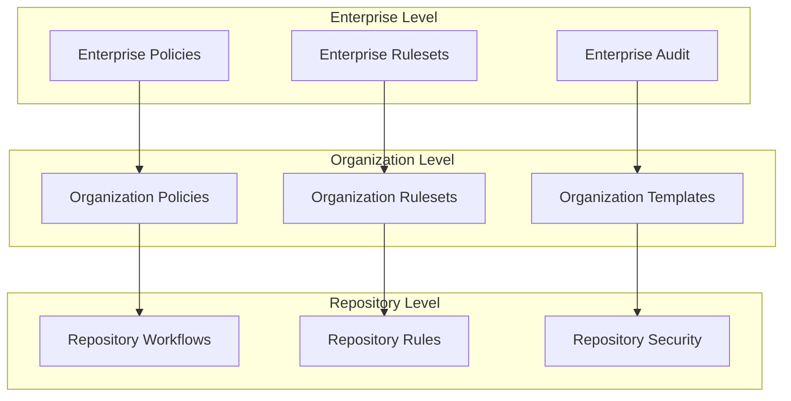

# CLAUDE.md

This file provides guidance to Claude Code (claude.ai/code) when working with code in this repository.

## Project Overview

This is a **Supply-Chain Guard Kit for GitHub Enterprise** designed to prevent advanced supply chain attacks and data exfiltration in CI/CD pipelines across GitHub organizations. The kit leverages StepSecurity Harden-Runner for runtime security monitoring and GitHub Repository Rulesets for organization-wide enforcement.

**Key Security Strategy:**
- StepSecurity Harden-Runner for runtime monitoring and egress control
- Repository Rulesets for organization-wide security workflow enforcement
- Multi-organization support via Enterprise-level policies
- Comprehensive vulnerability scanning and dependency hygiene

## Architecture

### Core Components

1. **Security Workflows** (`.github/workflows/`)
   - `supply-chain-security.yml`: Main security enforcement workflow with Harden-Runner
   - `supply-chain-security-production.yml`: Production-ready version with strict enforcement
   - Egress verification, Trivy scanning, package hygiene checks
   - Comprehensive security report generation (JSON, SARIF, HTML, Markdown)
   - Designed to run on both GitHub-hosted and self-hosted runners

2. **Repository Rulesets** (`.github/rulesets/`)
   - `organization-security-ruleset.json`: Organization-level security enforcement
   - `enterprise-security-ruleset.json`: Enterprise-wide security policies
   - Require security workflows as status checks for PR merging

3. **Network Policies** (`network-policies/`)
   - Kubernetes NetworkPolicy examples for self-hosted runners
   - Default-deny egress with selective allowlisting
   - GitHub endpoint allowlists for necessary connectivity

### Security Layers

1. **Runtime Security**: StepSecurity Harden-Runner monitors network, file, and process activity
2. **Organization Enforcement**: Repository Rulesets require security workflows on all repositories
3. **Vulnerability Scanning**: Trivy scans for HIGH/CRITICAL vulnerabilities
4. **Package Hygiene**: Install dependencies without executing potentially malicious scripts

## Common Commands

### Local Development Testing
```bash
# Test the security workflow locally (requires act or similar)
act pull_request -W .github/workflows/supply-chain-security.yml

# Validate JSON rulesets
cat .github/rulesets/organization-security-ruleset.json | jq .

# Test network policies (requires kubectl)
kubectl apply -f network-policies/ --dry-run=client
```

### Security Report Analysis
```bash
# Download and extract security reports
cd downloads && unzip security-reports-*.zip

# View summary report
cat security-summary.md

# Open HTML report in browser
open security-report.html

# Parse JSON report for automation
jq '.vulnerabilities[] | select(.severity == "HIGH")' vulnerability-report.json

# Upload SARIF to security tools
# SARIF can be imported into GitHub Security tab, SonarQube, etc.
```

### Repository Setup
```bash
# Apply security workflow to new repository
cp .github/workflows/supply-chain-security.yml /path/to/new/repo/.github/workflows/

# Import organization ruleset (via GitHub CLI)
gh api -X POST /orgs/ORGNAME/rulesets \
  --input .github/rulesets/organization-security-ruleset.json
```

### Harden-Runner Integration
```yaml
# Add to any workflow as the first step
- name: Harden Runner
  uses: step-security/harden-runner@17d0e2bd7d51742c71671bd19fa12bdc9d40a3d6 # v2.8.1
  with:
    egress-policy: block
    allowed-endpoints: >
      github.com:443
      api.github.com:443
```

## Multi-Organization Deployment

### Enterprise Setup
1. **Enterprise Rulesets**: Create at enterprise level to apply across all organizations
2. **Template Repositories**: Use `.github` repository in each organization for workflow templates
3. **Custom Properties**: Define repository classification (environment, security_level)
4. **Graduated Enforcement**: Start with 'evaluate' mode, progress to 'active' enforcement

### Organization Configuration
1. Create organization `.github` repository
2. Add `workflow-templates/` with security workflows
3. Configure organization-level rulesets referencing security checks
4. Set up CODEOWNERS for security team review

## Security Verification

### Testing Egress Controls
The security workflow includes automated testing:
- Attempts connection to `1.1.1.1` (should fail)
- Verifies allowed endpoints are accessible
- Reports results in workflow logs

### Monitoring Dashboard
- StepSecurity dashboard: https://app.stepsecurity.io/
- Review network connections, file changes, process activity
- Configure alerts for security violations

### Security Reports & Artifacts
Every workflow run generates **comprehensive security reports** available as downloadable artifacts:

**Generated Report Formats:**
- `security-summary.md` - Quick vulnerability overview with table format
- `vulnerability-report.json` - Machine-readable format for CI/CD integration
- `trivy-results.sarif` - Industry-standard format for security tools
- `security-report.html` - Rich web-based report with visual charts
- `final-security-report.md` - Comprehensive analysis with recommendations

**Accessing Reports:**
1. Navigate to **Actions** tab → Select workflow run
2. Scroll to **Artifacts** section
3. Download `security-reports-[run-number].zip`
4. Extract and review reports in preferred format

## Integration Points

### GitHub Features
- **Repository Rulesets**: Enforce security workflows as required status checks
- **Branch Protection**: Prevent direct pushes to protected branches
- **CODEOWNERS**: Require security team review for sensitive changes
- **Security Advisories**: Integration with GitHub's vulnerability database

### Third-party Tools
- **StepSecurity Harden-Runner**: Primary runtime security monitoring
- **Trivy Scanner**: Vulnerability scanning for dependencies and containers
- **Kubernetes NetworkPolicies**: Network-level egress control for self-hosted runners

## Documentation Structure

- `docs/00-scope.md`: Platform scope and assumptions
- `docs/10-why-it-works.md`: Attack model and defense strategy
- `docs/20-setup-harden-runner.md`: StepSecurity Harden-Runner configuration
- `docs/25-repository-rulesets.md`: Organization-wide enforcement setup
- `docs/30-verification.md`: Testing and validation procedures
- `docs/40-operations.md`: Lifecycle management and incident response

## Enterprise Considerations

### Compliance and Governance
- Repository custom properties for classification
- Delegated bypass controls for emergency situations
- Audit trails for all security policy changes
- Regular review cycles for allowlists and policies

### Performance Impact
- Harden-Runner adds ~10-30 seconds to workflow execution
- Network monitoring overhead is minimal on modern runners
- Vulnerability scanning time depends on codebase size

### Scalability
- Supports unlimited repositories per organization
- Enterprise rulesets can target thousands of repositories
- StepSecurity handles millions of workflow runs weekly

## Development Best Practices

### Code Quality Standards
- **Workflow Validation**: Use `act` or GitHub CLI for local testing
- **Configuration Linting**: Validate JSON rulesets with `jq` before deployment
- **Security Review**: All security configuration changes require peer review
- **Version Pinning**: Pin all action versions using commit SHAs for security

### Testing Strategy
```bash
# Comprehensive testing approach
# 1. Local workflow testing
act pull_request -W .github/workflows/supply-chain-security.yml

# 2. Configuration validation
yamllint .github/workflows/
jq empty .github/rulesets/*.json

# 3. Network policy testing
kubectl apply -f network-policies/ --dry-run=client --validate=true

# 4. End-to-end validation
gh workflow run "Supply Chain Security Guard" --repo $GITHUB_REPOSITORY
```

### Performance Optimization
- **Workflow Efficiency**: Minimize step count and optimize parallelization
- **Resource Management**: Monitor runner usage and optimize allocation
- **Cache Strategy**: Leverage GitHub Actions cache for dependency management
- **Report Optimization**: Use compressed artifacts for large security reports

## Enterprise Architecture Patterns

### Multi-Tier Security Strategy


### Deployment Patterns
1. **Progressive Rollout**: Start with low-risk repositories, gradually expand
2. **Blue-Green Enforcement**: Maintain parallel rule sets for testing
3. **Feature Flags**: Use repository properties for conditional enforcement
4. **Circuit Breakers**: Automatic rollback on high failure rates

### Security Governance Framework
```yaml
governance_structure:
  executive_sponsor: "Chief Information Security Officer"
  technical_lead: "Platform Engineering Manager"
  compliance_officer: "Risk Management Representative"
  developer_advocate: "Engineering Representative"

review_cycles:
  monthly: "Security metrics and KPI review"
  quarterly: "Policy effectiveness assessment"
  annually: "Complete framework audit and update"
  ad_hoc: "Incident response and emergency updates"

approval_matrix:
  enterprise_policies: "CISO + Legal + Compliance"
  organization_rulesets: "Security Team + Engineering Lead"
  repository_workflows: "Team Lead + Security Review"
  emergency_changes: "On-call Security Engineer"
```

## Maintenance and Operations

### Regular Maintenance Schedule

#### Weekly Tasks
- Review StepSecurity dashboard for anomalies
- Monitor workflow failure rates and performance metrics
- Update security report summaries for stakeholders
- Validate backup and recovery procedures

#### Monthly Tasks
- Update Harden-Runner to latest stable version
- Review and update endpoint allowlists
- Analyze security trend reports and metrics
- Conduct security policy effectiveness review

#### Quarterly Tasks
- Comprehensive security audit of all configurations
- Update enterprise rulesets based on organizational changes
- Review and update incident response procedures
- Validate disaster recovery and business continuity plans

#### Annual Tasks
- Complete security framework architecture review
- Update compliance documentation and certifications
- Conduct penetration testing and security assessments
- Strategic planning for next year's security roadmap

### Incident Response Procedures

#### Alert Classification
- **Critical (P0)**: Active security breach or system compromise
- **High (P1)**: Security violation or policy bypass detected
- **Medium (P2)**: Anomalous behavior or potential vulnerability
- **Low (P3)**: Configuration drift or minor policy violation

#### Response Timeline
- **P0**: Immediate response (< 15 minutes)
- **P1**: Urgent response (< 1 hour)
- **P2**: Standard response (< 4 hours)
- **P3**: Planned response (< 24 hours)

#### Escalation Matrix
```bash
# Emergency contacts and escalation paths
SECURITY_TEAM="security@company.com"
ON_CALL_ENGINEER="oncall-security@company.com"
INCIDENT_COMMANDER="incident-commander@company.com"
EXECUTIVE_ESCALATION="ciso@company.com"

# Automated alerting
SLACK_SECURITY_CHANNEL="#security-alerts"
PAGERDUTY_INTEGRATION="pd-security-incidents"
SPLUNK_DASHBOARD="security-monitoring"
```

### Troubleshooting Common Issues

#### Workflow Failures
```bash
# Common troubleshooting steps
# 1. Check Harden-Runner status
curl -s "https://api.stepsecurity.io/v1/github/$GITHUB_REPOSITORY/runs/$GITHUB_RUN_ID"

# 2. Validate endpoint connectivity
nslookup github.com
curl -I https://api.github.com

# 3. Review security report artifacts
gh run view $GITHUB_RUN_ID --log

# 4. Check ruleset configuration
gh api /orgs/$GITHUB_ORG/rulesets
```

#### Performance Issues
- **Slow Workflow Execution**: Review runner specifications and optimize workflow steps
- **High Resource Usage**: Implement workflow concurrency limits and resource monitoring
- **Network Timeouts**: Validate endpoint allowlists and network connectivity
- **Report Generation Delays**: Optimize Trivy scan scope and artifact compression

#### Configuration Drift
- **Automated Detection**: Use GitHub CLI to compare deployed vs. intended configurations
- **Remediation**: Implement GitOps approach for configuration management
- **Monitoring**: Set up alerts for unauthorized configuration changes
- **Audit Trail**: Maintain comprehensive logs of all configuration modifications

## Advanced Features and Customization

### Custom Security Policies
```yaml
# Example custom policy for high-security repositories
custom_security_policy:
  repository_classification: "high_security"
  additional_requirements:
    - require_signed_commits: true
    - mandatory_security_review: true
    - enhanced_monitoring: true
    - restricted_access: true

  workflow_modifications:
    - enforce_strict_egress_policy: true
    - require_manual_approval: true
    - additional_vulnerability_scanners: ["snyk", "sonarqube"]
    - enhanced_reporting: true
```

### Integration with Enterprise Tools
- **SIEM Integration**: Forward security events to Splunk, Elastic, or similar
- **Identity Management**: Integrate with Active Directory or LDAP for access control
- **Compliance Tools**: Connect with GRC platforms for automated compliance reporting
- **Monitoring Systems**: Integration with Datadog, New Relic, or Prometheus

### Custom Reporting and Analytics
```python
# Example custom report generation
import json
import requests
from datetime import datetime, timedelta

def generate_executive_security_dashboard():
    """Generate executive-level security metrics dashboard"""
    metrics = {
        "total_repositories": get_repository_count(),
        "security_compliance_rate": calculate_compliance_rate(),
        "critical_vulnerabilities": count_critical_vulns(),
        "security_incidents": get_incident_count(),
        "cost_avoidance": calculate_cost_avoidance()
    }

    return generate_dashboard_html(metrics)
```

## Future Roadmap and Enhancements

### Short-term Goals (Q1-Q2)
- AI-powered threat detection and response
- Enhanced mobile and responsive security reporting
- Integration with additional vulnerability scanners
- Automated compliance report generation

### Medium-term Goals (Q3-Q4)
- Zero-trust architecture implementation
- Advanced behavior analytics and anomaly detection
- Self-healing security configurations
- Predictive security risk assessment

### Long-term Vision (12-18 months)
- Fully autonomous security operations
- Machine learning-driven policy optimization
- Quantum-resistant cryptography implementation
- Global security orchestration platform

---

**Document Version**: 3.0.0
**Last Updated**: 2025-01-15
**Next Review**: 2025-02-15
**Review Cycle**: Monthly
**Maintained by**: Security Engineering Team

<div align="center">

**🛡️ Enterprise-grade supply chain security for modern development teams**

*"Security is not a product, but a process" - Enhanced for the cloud-native era*

</div>