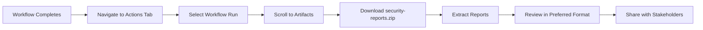
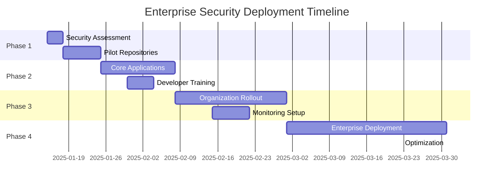

# Supply Chain Guard Kit for GitHub Enterprise

<div align="center">

[](https://opensource.org/licenses/MIT)
[](https://github.com/features/actions)
[](https://www.stepsecurity.io/)
[](https://github.com/enterprise)

**Enterprise-grade supply chain security for GitHub organizations**

*Runtime security monitoring and policy enforcement for GitHub Actions workflows*

</div>

## 🎯 Overview

A comprehensive, production-ready security framework designed to protect GitHub Enterprise organizations from sophisticated supply chain attacks. This solution combines runtime monitoring, organizational policy enforcement, and comprehensive security reporting to create multiple layers of defense.

### 🔒 Core Security Principles

- **🛡️ Defense in Depth**: Multiple security layers working together
- **📊 Continuous Monitoring**: Real-time visibility into CI/CD pipeline activities
- **🏢 Organization-wide Enforcement**: Consistent security policies across all repositories
- **📈 Evidence-based Security**: Comprehensive reporting and audit trails
- **⚡ Zero-disruption Implementation**: Minimal impact on developer workflows

### 🎯 Target Environment

- **Platform**: GitHub Enterprise Cloud/Server
- **Scope**: Multi-organization deployments
- **Runners**: GitHub-hosted and self-hosted runners
- **Scale**: Hundreds to thousands of repositories

### 🚀 Key Capabilities

| Security Layer | Technology | Purpose |
|----------------|------------|----------|
| **Runtime Monitoring** | StepSecurity Harden-Runner | Network egress control, file integrity monitoring |
| **Policy Enforcement** | GitHub Repository Rulesets | Organization-wide security workflow requirements |
| **Vulnerability Detection** | Trivy Scanner | HIGH/CRITICAL vulnerability identification |
| **Package Security** | Script-free Installation | Prevent malicious package lifecycle attacks |
| **Comprehensive Reporting** | Multi-format Reports | Security posture visibility and compliance |

## 📁 Repository Structure

```
supply-chain-guard-github/
├── .github/
│   ├── workflows/                    # Security enforcement workflows
│   │   ├── supply-chain-security.yml           # Demo/development workflow
│   │   └── supply-chain-security-production.yml # Production-ready workflow
│   └── rulesets/                     # GitHub Repository Rulesets
│       ├── organization-security-ruleset.json  # Organization-level policies
│       └── enterprise-security-ruleset.json    # Enterprise-wide policies
├── docs/                             # Comprehensive documentation
│   ├── 00-scope.md                  # Platform scope and assumptions
│   ├── 10-why-it-works.md           # Attack model and defense strategy
│   ├── 20-setup-harden-runner.md    # StepSecurity Harden-Runner setup
│   ├── 25-repository-rulesets.md    # Organization enforcement setup
│   ├── 30-verification.md           # Testing and validation procedures
│   └── 40-operations.md             # Lifecycle management
└── network-policies/                 # Kubernetes NetworkPolicies
    ├── github-runner-netpol.yaml    # Self-hosted runner network controls
    └── README.md                     # Network policy documentation
```

## 🚀 Quick Start Guide

### Prerequisites

- GitHub Enterprise Cloud or GitHub Enterprise Server
- Organization owner or enterprise admin permissions
- Basic understanding of GitHub Actions workflows
- (Optional) Kubernetes cluster for self-hosted runners

### 30-Second Setup

```bash
# 1. Clone the repository
git clone https://github.com/yourusername/supply-chain-guard-github.git
cd supply-chain-guard-github

# 2. Copy security workflow to your repository
cp .github/workflows/supply-chain-security.yml /path/to/your/repo/.github/workflows/

# 3. Apply organization ruleset (requires org admin)
gh api -X POST /orgs/YOUR_ORG/rulesets \
  --input .github/rulesets/organization-security-ruleset.json

# 4. Trigger workflow and monitor results
gh workflow run "Supply Chain Security Guard" --repo YOUR_ORG/YOUR_REPO
```

### Implementation Phases

| Phase | Duration | Activities | Outcome |
|-------|----------|------------|----------|
| **Phase 1: Assessment** | 1-2 days | Repository audit, runner inventory | Security baseline |
| **Phase 2: Pilot** | 1 week | Deploy to 3-5 repositories | Workflow validation |
| **Phase 3: Rollout** | 2-4 weeks | Organization-wide deployment | Full protection |
| **Phase 4: Optimization** | Ongoing | Monitor, tune, improve | Mature security posture |

## 📊 Security Reporting & Analytics

### 📈 Multi-format Security Reports

Every workflow execution generates comprehensive security artifacts with enterprise-grade reporting:

<div align="center">

| Report Type | Format | Use Case | Integration |
|------------|---------|----------|-------------|
| **Executive Summary** | `security-summary.md` | Leadership reporting | JIRA, Confluence |
| **Technical Analysis** | `vulnerability-report.json` | DevOps automation | CI/CD pipelines |
| **Standards Compliance** | `trivy-results.sarif` | Security tools | GitHub Security, SonarQube |
| **Visual Dashboard** | `security-report.html` | Team collaboration | Web browsers, SharePoint |
| **Comprehensive Assessment** | `final-security-report.md` | Security reviews | Documentation systems |

</div>

### 🔍 Report Contents

#### Executive Summary Report
- **Risk Overview**: HIGH/CRITICAL vulnerability counts
- **Compliance Status**: Security policy adherence
- **Trend Analysis**: Security posture over time
- **Action Items**: Prioritized remediation tasks

#### Technical Analysis Report
```json
{
  "scan_metadata": {
    "repository": "org/repo",
    "commit_sha": "abc123...",
    "scan_date": "2025-01-15T10:30:00Z",
    "harden_runner_version": "v2.11.1"
  },
  "vulnerabilities": [
    {
      "severity": "HIGH",
      "package": "example-lib",
      "cve": "CVE-2023-12345",
      "fixed_version": "2.1.0"
    }
  ],
  "network_monitoring": {
    "allowed_connections": 15,
    "blocked_attempts": 2,
    "anomalies_detected": 0
  }
}
```

### 📥 Report Access Workflow



### 🔗 Live Monitoring Integration

#### StepSecurity Dashboard
- **Real-time Monitoring**: https://app.stepsecurity.io/
- **Network Traffic Analysis**: Complete egress visibility
- **Behavioral Analytics**: Anomaly detection and alerting
- **Compliance Reporting**: Policy adherence tracking

#### Integration APIs
```bash
# Export data to external systems
curl -H "Authorization: Bearer $STEPSECURITY_TOKEN" \
  "https://api.stepsecurity.io/v1/reports/repository/ORG/REPO"

# Webhook notifications for security events
curl -X POST "$SLACK_WEBHOOK" \
  -d '{"text": "Security alert: Unauthorized egress detected"}'
```

## 🏢 Enterprise Multi-Organization Architecture

### 🔧 Enterprise Configuration Management

#### Centralized Policy Management
```yaml
# Enterprise-level ruleset configuration
enterprises:
  - name: "ACME Corp"
    organizations: ["acme-frontend", "acme-backend", "acme-mobile"]
    security_policies:
      - require_harden_runner: true
      - vulnerability_threshold: "HIGH"
      - network_monitoring: "enabled"
      - bypass_permissions: ["security-team"]
```

#### Repository Classification System
| Property | Values | Security Level | Monitoring |
|----------|---------|----------------|------------|
| **Environment** | `production`, `staging`, `development` | Critical → Standard | Real-time → Daily |
| **Sensitivity** | `public`, `internal`, `confidential` | Open → Restricted | Basic → Enhanced |
| **Compliance** | `sox`, `pci`, `hipaa`, `none` | Strict → Standard | Audit → Monitor |

### 🎯 Deployment Strategies

#### Graduated Rollout Approach


### 📋 Governance Framework

#### Security Governance Board
- **Executive Sponsor**: Chief Information Security Officer
- **Technical Lead**: Platform Engineering Manager
- **Compliance Officer**: Risk Management Representative
- **Developer Advocate**: Engineering Representative

#### Policy Review Cycle
- **Monthly**: Security metrics review
- **Quarterly**: Policy effectiveness assessment
- **Annually**: Complete framework review
- **Ad-hoc**: Incident response and policy updates

## 📞 Support & Community

### 🆘 Getting Help

- **Documentation**: Complete guides in `/docs/` directory
- **Issues**: Report bugs and feature requests via GitHub Issues
- **Discussions**: Community support via GitHub Discussions
- **Security**: Report security vulnerabilities privately

### 🤝 Contributing

We welcome contributions! Please see our [Contributing Guidelines](CONTRIBUTING.md) for details on:
- Code of Conduct
- Development setup
- Pull request process
- Security disclosure policy

### 📜 License

This project is licensed under the MIT License - see the [LICENSE](LICENSE) file for details.

### 🏷️ Version Information

- **Current Version**: v1.0.0
- **StepSecurity Harden-Runner**: v2.11.1
- **Trivy Scanner**: v0.23.0
- **Last Updated**: 2025-01-15
- **Compatibility**: GitHub Enterprise Cloud/Server 3.7+

---

<div align="center">

**Built with ❤️ for GitHub Enterprise Security**

*Protecting your software supply chain, one commit at a time*

</div>