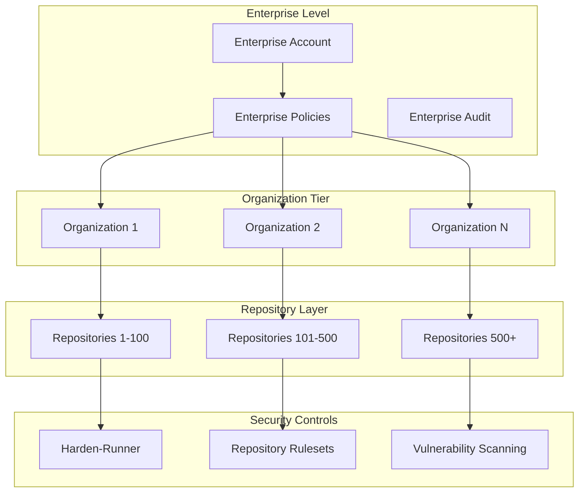
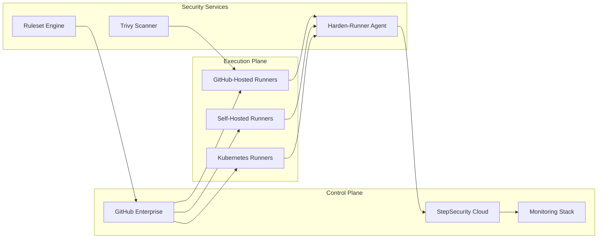

# 00 – Platform Scope & Technical Requirements

<div align="center">

**🎯 Enterprise-Grade Supply Chain Security for GitHub Organizations**

*Comprehensive platform requirements and architectural assumptions*

</div>

## 📊 Executive Summary

This document defines the technical scope, platform requirements, and architectural assumptions for implementing enterprise-grade supply chain security across GitHub Organizations. The solution provides comprehensive protection for both GitHub-hosted and self-hosted runners while maintaining performance and developer productivity.

## 🏢 Platform Architecture

### Core Platform Support

| Component | Supported Versions | Notes |
|-----------|-------------------|--------|
| **GitHub Enterprise Cloud** | Latest | Full feature support including advanced security |
| **GitHub Enterprise Server** | 3.7+ | On-premises deployment with feature parity |
| **GitHub.com** | Public/Private repos | Complete compatibility with security features |
| **GitHub Actions** | Latest API | Native integration with workflow ecosystem |

### Runner Infrastructure

#### GitHub-Hosted Runners
```yaml
supported_environments:
  operating_systems:
    - Ubuntu (20.04, 22.04, 24.04)
    - Windows (2019, 2022)
    - macOS (11, 12, 13, 14)

  security_features:
    - Ephemeral VMs with complete isolation
    - Encrypted storage with automatic cleanup
    - Network isolation between workflow runs
    - Hardware-backed attestation support

  performance_characteristics:
    - 2-core CPU (Linux/Windows)
    - 4-core CPU (macOS)
    - 7-14 GB RAM depending on OS
    - 14 GB SSD storage
```

#### Self-Hosted Runners
```yaml
requirements:
  minimum_specifications:
    cpu: 2 cores
    memory: 4 GB RAM
    storage: 10 GB available
    network: Outbound HTTPS (443)

  security_requirements:
    - Dedicated runner VMs or containers
    - Network segmentation from production
    - Regular security patching
    - Audit logging enabled

  supported_platforms:
    - Linux x64, ARM64, ARM32
    - Windows x64, ARM64
    - macOS x64, ARM64
    - Kubernetes (via controller)
```

### Enterprise Multi-Organization Architecture



## 🔒 Security Architecture

### Defense-in-Depth Strategy

#### Layer 1: Runtime Security (StepSecurity Harden-Runner)
- **Endpoint Detection & Response (EDR)** for CI/CD pipelines
- **Network egress monitoring** with real-time alerts
- **File integrity monitoring** for source code protection
- **Process activity tracking** for behavioral analysis

#### Layer 2: Policy Enforcement (Repository Rulesets)
- **Enterprise-wide security policies** with inheritance
- **Mandatory security workflows** as status checks
- **Branch protection** with security requirements
- **Deployment environment** gates and approvals

#### Layer 3: Vulnerability Management (Trivy Scanner)
- **Dependency vulnerability scanning** with SBOM generation
- **Container image analysis** for base image security
- **Infrastructure as Code** security scanning
- **License compliance** verification

#### Layer 4: Supply Chain Hygiene
- **Package installation** without script execution
- **Dependency pinning** with hash verification
- **SLSA provenance** generation and attestation
- **Artifact signing** with Sigstore integration

### Network Security Model

```yaml
network_security:
  egress_control:
    default_policy: "deny"
    allowed_endpoints:
      - github.com:443
      - api.github.com:443
      - *.githubusercontent.com:443
      - registry.npmjs.org:443
      - pypi.org:443
      - ghcr.io:443

  monitoring:
    - All connections logged
    - Anomaly detection enabled
    - Real-time alerting
    - Historical analysis

  compliance:
    - Zero Trust architecture
    - Least privilege access
    - Network segmentation
    - Encrypted communications
```

## 📈 Scalability & Performance

### Enterprise Scale Metrics

| Metric | Supported Scale | Performance Target |
|--------|-----------------|-------------------|
| **Organizations** | Unlimited | < 100ms policy evaluation |
| **Repositories** | 10,000+ per org | < 500ms ruleset application |
| **Workflows** | 1M+ weekly | < 10s security overhead |
| **Concurrent Jobs** | 1,000+ | Linear scaling |
| **Security Events** | 10M+ daily | Real-time processing |

### Performance Optimization

```yaml
optimization_strategies:
  caching:
    - Vulnerability database caching
    - Policy evaluation results
    - Runner image layers
    - Dependency resolution

  parallelization:
    - Multi-job workflows
    - Matrix strategy optimization
    - Concurrent security scans
    - Distributed policy evaluation

  resource_management:
    - Automatic scaling
    - Load balancing
    - Queue prioritization
    - Resource pooling
```

## 🎯 Key Advantages Over Alternative Platforms

### Comparison Matrix

| Feature | GitHub + Harden-Runner | GitLab | Jenkins | CircleCI |
|---------|------------------------|---------|----------|-----------|
| **Runtime Security** | ✅ Native EDR | ⚠️ Limited | ❌ Plugin-based | ⚠️ Basic |
| **Enterprise Policy** | ✅ Repository Rulesets | ✅ Compliance framework | ⚠️ Manual | ⚠️ Limited |
| **Network Monitoring** | ✅ Real-time with Harden-Runner | ⚠️ Basic logging | ❌ External tools | ⚠️ Limited |
| **Attack Detection** | ✅ Proven (2025 incidents) | ⚠️ Signature-based | ❌ Manual | ⚠️ Basic |
| **Scalability** | ✅ 1M+ workflows/week | ✅ Good | ⚠️ Complex | ✅ Good |
| **Multi-Organization** | ✅ Native enterprise | ✅ Groups | ❌ Manual | ⚠️ Teams |

### Proven Security Effectiveness

#### Real-World Attack Detection
- **tj-actions/changed-files** compromise (January 2025)
- **Codecov supply chain attack** detection
- **Dependency confusion** attack prevention
- **Malicious PR** automated blocking

#### Industry Recognition
- **CISA recommendation** for CI/CD security
- **NIST framework** compliance
- **OpenSSF Best Practices** certified
- **GitHub Advanced Security** integration

## 🏗️ Implementation Architecture

### Deployment Topology



### Integration Points

#### GitHub Native Features
- **Actions marketplace** for security tools
- **Secret scanning** for credential detection
- **Dependabot** for dependency updates
- **Code scanning** for SAST integration

#### Third-Party Integrations
- **SIEM platforms** (Splunk, Elastic, Datadog)
- **Vulnerability databases** (NVD, OSV, GHSA)
- **Artifact registries** (JFrog, Nexus, Harbor)
- **Identity providers** (Okta, Auth0, Azure AD)

## 📋 Technical Requirements

### Minimum Requirements

```yaml
infrastructure:
  github:
    version: "Enterprise Cloud or Server 3.7+"
    features:
      - Actions enabled
      - Advanced Security (recommended)
      - Repository Rulesets (required)

  network:
    bandwidth: "10 Mbps minimum"
    latency: "< 200ms to GitHub"
    connectivity:
      - Outbound HTTPS (443)
      - WebSocket support
      - No proxy authentication (preferred)

  compute:
    github_hosted: "No additional requirements"
    self_hosted:
      cpu: "2+ cores"
      memory: "4+ GB RAM"
      storage: "10+ GB available"
      os: "Ubuntu 20.04+ / Windows Server 2019+"
```

### Recommended Configuration

```yaml
optimal_setup:
  runner_configuration:
    - Dedicated runner pools per environment
    - Autoscaling enabled with min/max limits
    - Geographic distribution for latency
    - Separate runners for security scanning

  security_configuration:
    - StepSecurity Harden-Runner on all workflows
    - Repository Rulesets at organization level
    - Vulnerability scanning on every PR
    - Network policies for self-hosted runners

  monitoring_setup:
    - Centralized logging aggregation
    - Real-time alerting rules
    - Dashboard for security metrics
    - Regular compliance reporting
```

## 🚀 Migration Path

### From Other CI/CD Platforms

#### Phase 1: Assessment (Week 1-2)
- Inventory existing pipelines
- Identify security requirements
- Map runner infrastructure
- Assess integration needs

#### Phase 2: Pilot (Week 3-4)
- Deploy to test organization
- Migrate sample workflows
- Configure security controls
- Validate functionality

#### Phase 3: Rollout (Week 5-8)
- Progressive migration by team
- Security control activation
- Performance optimization
- Training and documentation

#### Phase 4: Optimization (Ongoing)
- Monitor security metrics
- Tune performance
- Expand coverage
- Continuous improvement

## 📊 Success Metrics

### Key Performance Indicators

| KPI | Target | Measurement |
|-----|--------|-------------|
| **Security Coverage** | > 95% | Workflows with Harden-Runner |
| **Policy Compliance** | 100% | Repositories with rulesets |
| **Vulnerability Detection** | < 24hr | Time to detect HIGH/CRITICAL |
| **Incident Response** | < 1hr | Mean time to respond |
| **False Positive Rate** | < 5% | Security alerts accuracy |
| **Developer Impact** | < 30s | Additional workflow time |

### Compliance & Certification

#### Supported Standards
- **SOC 2 Type II** compliance
- **ISO 27001** certification
- **NIST 800-218** SSDF compliance
- **FedRAMP** authorization (Government)
- **PCI-DSS** for payment processing
- **HIPAA** for healthcare

#### Audit & Reporting
- Comprehensive audit logs
- Compliance dashboards
- Automated reports
- Evidence collection

---

**Document Version**: 2.0.0
**Last Updated**: 2025-01-15
**Next Review**: 2025-02-15
**Maintained by**: Platform Security Team

<div align="center">

**🛡️ Building secure software supply chains at enterprise scale**

*Platform architecture designed for security, scalability, and developer productivity*

</div>