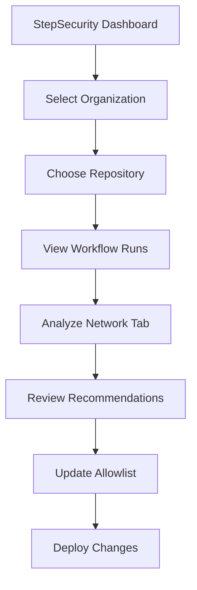
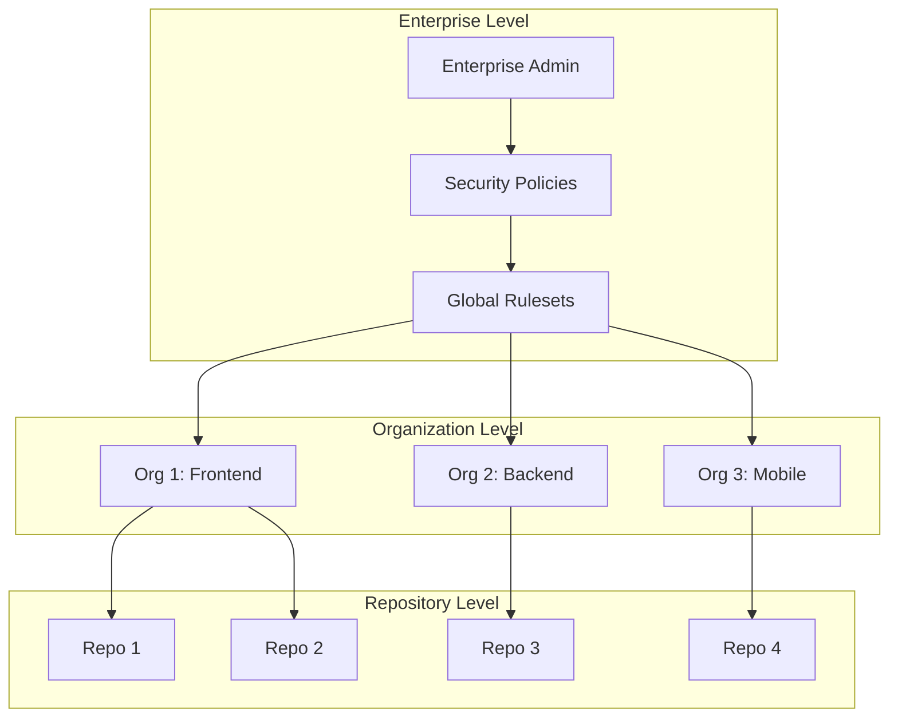
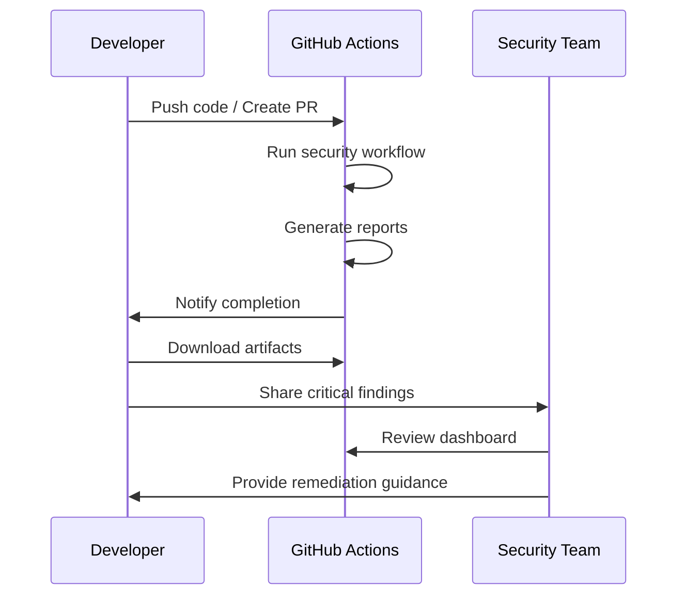

# Setup Guide: StepSecurity Harden-Runner

<div align="center">

[](https://www.stepsecurity.io/)
[](https://github.com/features/actions)
[](https://github.com/enterprise)

**Comprehensive setup guide for enterprise-grade CI/CD security**

</div>

## 📝 Table of Contents

- [Runner Strategy Selection](#🎯-runner-strategy-selection)
- [Basic Harden-Runner Setup](#⚙️-basic-harden-runner-setup)
- [Enterprise Configuration](#🏢-enterprise-configuration)
- [Self-hosted Runner Hardening](#🖥️-self-hosted-runner-hardening)
- [Security Reporting](#📊-security-reporting--analytics)
- [Verification & Testing](#✅-verification--testing)
- [Advanced Configuration](#🔧-advanced-configuration)
- [Troubleshooting](#🔍-troubleshooting-guide)

## 🎯 Runner Strategy Selection

### 🌐 GitHub-hosted Runners (Recommended)

**Advantages:**
- ✅ **Zero Infrastructure Overhead**: No server management required
- ✅ **Built-in Security**: Ephemeral VMs with network isolation
- ✅ **Automatic Updates**: Always running latest security patches
- ✅ **Enterprise Features**: ARM runners, eBPF monitoring (Enterprise tier)
- ✅ **Cost Effective**: Pay-per-use pricing model

**Security Features:**
- Isolated execution environment per job
- Network egress monitoring via Harden-Runner
- Automatic cleanup after job completion
- GitHub-managed infrastructure security

### 🖥️ Self-hosted Runners

**Use Cases:**
- Compliance requirements for on-premises execution
- Integration with internal systems and databases
- Custom hardware or software requirements
- Network access to private resources

**Implementation Options:**

#### Option 1: Virtual Machine Runners
```bash
# Create secure golden image
# - Minimal OS installation (Ubuntu 22.04 LTS recommended)
# - Security hardening (CIS benchmarks)
# - Harden-Runner agent pre-installed
# - Regular patching automation
```

#### Option 2: Kubernetes Runners (Recommended)
```yaml
# GitHub Actions Runner Controller (ARC)
apiVersion: actions.sumologic.com/v1alpha1
kind: RunnerDeployment
metadata:
  name: secure-runners
spec:
  replicas: 3
  template:
    spec:
      repository: org/repo
      securityContext:
        runAsNonRoot: true
        runAsUser: 1001
      resources:
        limits:
          memory: "2Gi"
          cpu: "1000m"
```

**Security Considerations:**
- ⚠️ **Infrastructure Responsibility**: You manage all security aspects
- ⚠️ **Network Security**: Implement proper egress controls
- ⚠️ **Patch Management**: Maintain up-to-date systems
- ⚠️ **Access Control**: Secure runner registration and access

## ⚙️ Basic Harden-Runner Setup

### Step 1: Workflow Integration

**Critical**: Harden-Runner must be the **first step** in every job for complete security coverage.

#### Basic Configuration
```yaml
name: Secure CI/CD Pipeline

on:
  push:
    branches: [ main, develop ]
  pull_request:
    branches: [ main ]

jobs:
  secure-build:
    runs-on: ubuntu-latest

    steps:
      # 🛡️ CRITICAL: Always first step
      - name: Harden Runner
        uses: step-security/harden-runner@c6295a65d1254861815972266d5933fd6e532bdf # v2.11.1
        with:
          egress-policy: audit  # Start with audit, move to block for production
          disable-sudo: true    # Disable sudo access for security
          allowed-endpoints: >
            github.com:443
            api.github.com:443
            uploads.github.com:443
            objects.githubusercontent.com:443
            registry.npmjs.org:443
            pypi.org:443
            docker.io:443
            registry-1.docker.io:443

      - name: Checkout Repository
        uses: actions/checkout@v4

      # ... rest of your workflow steps
```

### Step 2: Egress Policy Configuration

| Policy | Environment | Behavior | Recommendation |
|--------|-------------|----------|----------------|
| **`audit`** | Development/Testing | Monitor and log all egress | Start here for learning |
| **`block`** | Production | Enforce strict allowlist | Move here after tuning |

#### Development Phase (Learning Mode)
```yaml
- name: Harden Runner (Learning)
  uses: step-security/harden-runner@c6295a65d1254861815972266d5933fd6e532bdf # v2.11.1
  with:
    egress-policy: audit
    disable-sudo: false  # Allow for development flexibility
```

#### Production Phase (Enforcement Mode)
```yaml
- name: Harden Runner (Production)
  uses: step-security/harden-runner@c6295a65d1254861815972266d5933fd6e532bdf # v2.11.1
  with:
    egress-policy: block
    disable-sudo: true
    allowed-endpoints: >
      # Core GitHub endpoints
      github.com:443
      api.github.com:443
      uploads.github.com:443
      objects.githubusercontent.com:443

      # Package registries (customize as needed)
      registry.npmjs.org:443
      registry.yarnpkg.com:443
      pypi.org:443
      files.pythonhosted.org:443

      # Container registries
      ghcr.io:443
      docker.io:443
      registry-1.docker.io:443
      auth.docker.io:443
      production.cloudflare.docker.com:443
```

### Step 3: Monitoring and Dashboard

#### StepSecurity Dashboard Access
1. **Navigate to**: https://app.stepsecurity.io/
2. **Sign in** with your GitHub account
3. **Select your organization** and repository
4. **Review network activity** in real-time

#### Key Monitoring Areas
- **Network Connections**: All egress attempts (allowed/blocked)
- **File Integrity**: Changes to critical files during execution
- **Process Activity**: Command execution and process spawning
- **Security Anomalies**: Unusual patterns or suspicious behavior

#### Dashboard Navigation


## 🏢 Enterprise Configuration

### Multi-Organization Architecture

#### Centralized Security Management


#### Template Repository Strategy

**1. Create Organization Template Repository**
```bash
# Create .github repository in each organization
gh repo create .github --template --public

# Directory structure
.github/
├── workflow-templates/
│   ├── supply-chain-security.yml
│   ├── supply-chain-security.properties.json
│   └── README.md
├── rulesets/
│   └── organization-security.json
└── profile/
    └── README.md
```

**2. Workflow Template Configuration**
```json
{
    "name": "Supply Chain Security Guard",
    "description": "Enterprise security workflow with Harden-Runner protection",
    "iconName": "shield",
    "categories": ["security", "ci"],
    "filePatterns": ["package*.json", "requirements*.txt", "go.mod", "Cargo.toml"]
}
```

#### Repository Rulesets Implementation

**Enterprise-Level Ruleset**
```json
{
  "name": "Enterprise Security Requirements",
  "target": "branch",
  "enforcement": "active",
  "conditions": {
    "ref_name": {
      "include": ["refs/heads/main", "refs/heads/master"],
      "exclude": []
    }
  },
  "rules": [
    {
      "type": "required_status_checks",
      "parameters": {
        "required_status_checks": [
          {
            "context": "Supply Chain Security Enforcement",
            "integration_id": null
          }
        ],
        "strict_required_status_checks_policy": true
      }
    }
  ]
}
```

### Advanced Enterprise Features

#### StepSecurity Enterprise Tier Benefits

| Feature | Community | Enterprise |
|---------|-----------|------------|
| **GitHub-hosted Runners** | ✅ Linux x64 | ✅ Linux x64 + ARM |
| **Self-hosted Runners** | ✅ Basic | ✅ Advanced eBPF |
| **Network Monitoring** | ✅ Basic | ✅ HTTPS request details |
| **Private Repositories** | ❌ Limited | ✅ Full support |
| **Support Level** | Community | Enterprise SLA |
| **Custom Policies** | ❌ No | ✅ Yes |

#### Advanced Monitoring Capabilities

**eBPF Monitoring (Enterprise)**
```yaml
- name: Harden Runner (Enterprise)
  uses: step-security/harden-runner@c6295a65d1254861815972266d5933fd6e532bdf # v2.11.1
  with:
    egress-policy: block
    disable-sudo: true
    enable-ebpf: true  # Enterprise feature
    monitor-http-details: true  # Track HTTP methods and paths
```

**Custom Security Policies**
```yaml
# Enterprise custom policy example
security_policies:
  network:
    allowed_domains:
      - "*.github.com"
      - "*.npmjs.org"
      - "company-internal.com"
    blocked_ips:
      - "0.0.0.0/0"  # Block all by default
  file_integrity:
    protected_paths:
      - "/etc/passwd"
      - "/etc/shadow"
      - "~/.ssh/"
  process_monitoring:
    blocked_commands:
      - "wget"
      - "curl" # unless in allowlist
```

## 🖥️ Self-hosted Runner Hardening

### Kubernetes (ARC) Setup

#### Prerequisites
```bash
# Install Actions Runner Controller
helm repo add actions-runner-controller https://actions-runner-controller.github.io/actions-runner-controller
helm upgrade --install --namespace actions-runner-system --create-namespace \
  --wait actions-runner-controller actions-runner-controller/actions-runner-controller
```

#### Secure Runner Deployment
```yaml
apiVersion: actions.sumologic.com/v1alpha1
kind: RunnerDeployment
metadata:
  name: secure-github-runners
  namespace: github-runners
spec:
  replicas: 5
  template:
    spec:
      repository: organization/repository
      image: sumologic/actions-runner:latest

      # Security hardening
      securityContext:
        runAsNonRoot: true
        runAsUser: 1001
        runAsGroup: 1001
        fsGroup: 1001
        seccompProfile:
          type: RuntimeDefault

      # Resource limits
      resources:
        requests:
          memory: "1Gi"
          cpu: "500m"
        limits:
          memory: "2Gi"
          cpu: "1000m"

      # Network policies
      nodeSelector:
        kubernetes.io/os: linux
        security-zone: restricted

      tolerations:
      - key: "dedicated"
        operator: "Equal"
        value: "github-runners"
        effect: "NoSchedule"
```

#### Network Security Policies
```yaml
apiVersion: networking.k8s.io/v1
kind: NetworkPolicy
metadata:
  name: github-runner-netpol
  namespace: github-runners
spec:
  podSelector:
    matchLabels:
      app: github-runner
  policyTypes:
  - Egress
  egress:
  # Allow GitHub API access
  - to: []
    ports:
    - protocol: TCP
      port: 443
    - protocol: TCP
      port: 80
  # Allow DNS resolution
  - to:
    - namespaceSelector:
        matchLabels:
          name: kube-system
    ports:
    - protocol: UDP
      port: 53
```

### VM Runner Setup

#### Golden Image Creation
```bash
#!/bin/bash
# create-golden-image.sh

# Base system hardening
apt update && apt upgrade -y
apt install -y fail2ban ufw docker.io

# Configure firewall
ufw default deny incoming
ufw default deny outgoing
ufw allow out 443/tcp  # HTTPS
ufw allow out 53/udp   # DNS
ufw enable

# Install GitHub Actions runner
mkdir -p /opt/actions-runner
cd /opt/actions-runner
curl -o actions-runner-linux-x64-2.311.0.tar.gz -L \
  https://github.com/actions/runner/releases/download/v2.311.0/actions-runner-linux-x64-2.311.0.tar.gz
tar xzf ./actions-runner-linux-x64-2.311.0.tar.gz

# Security configurations
echo "* hard nofile 65536" >> /etc/security/limits.conf
echo "* soft nofile 65536" >> /etc/security/limits.conf

# Disable unnecessary services
systemctl disable bluetooth cups avahi-daemon

# Set up runner user
useradd -m -s /bin/bash github-runner
usermod -aG docker github-runner

# Configure automated security updates
apt install -y unattended-upgrades
echo 'Unattended-Upgrade::Automatic-Reboot "true";' >> /etc/apt/apt.conf.d/50unattended-upgrades
```

## 📊 Security Reporting & Analytics

### Comprehensive Report Generation

Every workflow execution produces enterprise-grade security documentation across multiple formats for different stakeholders:

#### Report Portfolio

| Report Type | Format | Target Audience | Integration Points |
|-------------|--------|-----------------|---------------------|
| **Executive Summary** | `security-summary.md` | Leadership, PMO | JIRA, Confluence, Slack |
| **Technical Deep Dive** | `vulnerability-report.json` | DevOps, Security | CI/CD, SIEM, Dashboards |
| **Compliance Export** | `trivy-results.sarif` | Compliance, Auditors | GitHub Security, SonarQube |
| **Visual Dashboard** | `security-report.html` | Teams, Stakeholders | Browsers, SharePoint |
| **Complete Assessment** | `final-security-report.md` | Security Reviews | Documentation Systems |

### Report Content Structure

#### Executive Summary (`security-summary.md`)
```markdown
# Security Scan Executive Summary

## Key Metrics
- **Risk Level**: LOW | MEDIUM | HIGH | CRITICAL
- **Vulnerabilities Found**: X HIGH, Y CRITICAL
- **Compliance Status**: ✅ PASS | ❌ FAIL
- **Network Security**: ✅ MONITORED

## Action Required
1. Address CRITICAL vulnerabilities (ETA: 24h)
2. Review HIGH severity findings (ETA: 7d)
3. Update dependencies to recommended versions
```

#### Technical Analysis (`vulnerability-report.json`)
```json
{
  "metadata": {
    "scan_timestamp": "2025-01-15T10:30:00Z",
    "repository": "org/repository",
    "commit_sha": "abc123...",
    "harden_runner_version": "v2.11.1",
    "compliance_frameworks": ["SOX", "PCI", "SOC2"]
  },
  "summary": {
    "total_vulnerabilities": 15,
    "by_severity": {
      "CRITICAL": 2,
      "HIGH": 5,
      "MEDIUM": 8,
      "LOW": 0
    }
  },
  "network_monitoring": {
    "egress_policy": "block",
    "allowed_connections": 23,
    "blocked_attempts": 0,
    "anomalies": []
  }
}
```

### Report Access Workflow

#### Automated Distribution
```yaml
# Add to your workflow for automatic report distribution
- name: Distribute Security Reports
  if: always()
  run: |
    # Upload to security dashboard
    curl -X POST "$SECURITY_API/reports" \
      -H "Authorization: Bearer $API_TOKEN" \
      -F "report=@security-reports/final-security-report.md"

    # Notify security team on findings
    if [ "$(jq '.summary.by_severity.CRITICAL' vulnerability-report.json)" != "0" ]; then
      curl -X POST "$SLACK_WEBHOOK" \
        -d '{"text": "🚨 CRITICAL vulnerabilities found in ${{ github.repository }}"}'
    fi
```

#### Manual Access Process


### Integration with External Systems

#### SIEM Integration
```bash
# Splunk integration example
curl -X POST "https://splunk.company.com:8088/services/collector" \
  -H "Authorization: Splunk $SPLUNK_TOKEN" \
  -d @vulnerability-report.json
```

#### Compliance Automation
```bash
# SOX compliance report generation
jq '.vulnerabilities[] | select(.compliance_impact == "SOX")' \
  vulnerability-report.json > sox-findings.json
```

## ✅ Verification & Testing

### Pre-deployment Testing

#### Local Workflow Validation
```bash
# Install act for local testing (optional)
curl https://raw.githubusercontent.com/nektos/act/master/install.sh | sudo bash

# Test workflow locally
act pull_request -W .github/workflows/supply-chain-security.yml

# Validate workflow syntax
gh workflow view "Supply Chain Security Guard"
```

#### Network Connectivity Tests
```bash
#!/bin/bash
# network-test.sh - Run inside workflow for validation

echo "🔍 Testing network connectivity..."

# Test allowed endpoints (should succeed)
ALLOWED_ENDPOINTS=(
  "https://github.com"
  "https://api.github.com"
  "https://registry.npmjs.org"
  "https://pypi.org"
)

for endpoint in "${ALLOWED_ENDPOINTS[@]}"; do
  if curl -fsS --max-time 10 "$endpoint" > /dev/null; then
    echo "✅ PASS: $endpoint reachable"
  else
    echo "❌ FAIL: $endpoint blocked (unexpected)"
  fi
done

# Test blocked endpoints (should fail in block mode)
BLOCKED_ENDPOINTS=(
  "http://httpbin.org/get"
  "https://1.1.1.1"
  "https://example.com"
)

for endpoint in "${BLOCKED_ENDPOINTS[@]}"; do
  if curl -fsS --max-time 5 "$endpoint" > /dev/null 2>&1; then
    echo "⚠️ AUDIT: $endpoint accessible (logged by Harden-Runner)"
  else
    echo "✅ BLOCK: $endpoint properly blocked"
  fi
done

echo "📊 Check StepSecurity dashboard: https://app.stepsecurity.io/"
```

### Post-deployment Monitoring

#### Security Metrics Dashboard
```bash
# Create monitoring script
cat > monitor-security.sh << 'EOF'
#!/bin/bash

# Fetch latest security metrics
ORG="your-org"
REPO="your-repo"

echo "Security Status for $ORG/$REPO"
echo "=============================="

# Get latest workflow run status
STATUS=$(gh run list --repo "$ORG/$REPO" --workflow="Supply Chain Security Guard" --limit=1 --json conclusion --jq '.[0].conclusion')
echo "Latest Workflow: $STATUS"

# Download and analyze latest security report
gh run download --repo "$ORG/$REPO" --name "security-reports*" --dir ./reports

# Extract key metrics
if [ -f "reports/vulnerability-report.json" ]; then
  CRITICAL=$(jq '.summary.by_severity.CRITICAL // 0' reports/vulnerability-report.json)
  HIGH=$(jq '.summary.by_severity.HIGH // 0' reports/vulnerability-report.json)
  echo "Vulnerabilities: $CRITICAL critical, $HIGH high"
fi

echo "Dashboard: https://app.stepsecurity.io/github/$ORG/$REPO"
EOF

chmod +x monitor-security.sh
```

### Troubleshooting Common Issues

#### Workflow Failures

| Issue | Symptom | Solution |
|-------|---------|----------|
| **Permission Error** | "Resource not accessible by integration" | Add `security-events: write` permission |
| **Egress Block** | "Connection refused" in audit mode | Update allowed-endpoints list |
| **SARIF Upload** | "Invalid SARIF file" | Ensure Trivy generates valid SARIF |
| **Missing Reports** | "Artifact not found" | Check if workflow completed successfully |

#### Debug Commands
```bash
# Check workflow permissions
gh api repos/:owner/:repo/actions/permissions

# View workflow logs
gh run view --repo org/repo --log

# Test SARIF validity
jq . trivy-results.sarif > /dev/null && echo "Valid SARIF" || echo "Invalid SARIF"

# Validate allowed endpoints
echo "github.com:443" | nc -zv github.com 443
```

#### StepSecurity Dashboard Issues

**No Data Showing:**
1. Verify Harden-Runner is first step in workflow
2. Check repository is public or StepSecurity has access
3. Ensure workflow has run at least once
4. Confirm GitHub account is linked to StepSecurity

**Missing Network Data:**
1. Verify `egress-policy` is set to `audit` or `block`
2. Check if workflow makes network calls
3. Ensure sufficient permissions for monitoring
4. Review workflow logs for Harden-Runner initialization

## 🔧 Advanced Configuration

### Custom Endpoint Management

#### Dynamic Allowlist Generation
```yaml
# Generate allowlist based on package.json dependencies
- name: Generate Dynamic Allowlist
  run: |
    ENDPOINTS="github.com:443\napi.github.com:443\n"

    # Add npm registry if Node.js project
    if [ -f "package.json" ]; then
      ENDPOINTS+="registry.npmjs.org:443\n"
      ENDPOINTS+="registry.yarnpkg.com:443\n"
    fi

    # Add PyPI if Python project
    if [ -f "requirements.txt" ] || [ -f "pyproject.toml" ]; then
      ENDPOINTS+="pypi.org:443\n"
      ENDPOINTS+="files.pythonhosted.org:443\n"
    fi

    # Add Docker registries if Dockerfile exists
    if [ -f "Dockerfile" ]; then
      ENDPOINTS+="docker.io:443\n"
      ENDPOINTS+="registry-1.docker.io:443\n"
      ENDPOINTS+="auth.docker.io:443\n"
    fi

    echo "Generated allowlist:"
    echo -e "$ENDPOINTS"
```

#### Environment-specific Configuration
```yaml
# Production environment
- name: Harden Runner (Production)
  if: github.ref == 'refs/heads/main'
  uses: step-security/harden-runner@c6295a65d1254861815972266d5933fd6e532bdf # v2.11.1
  with:
    egress-policy: block
    disable-sudo: true
    allowed-endpoints: ${{ secrets.PRODUCTION_ALLOWLIST }}

# Development environment
- name: Harden Runner (Development)
  if: github.ref != 'refs/heads/main'
  uses: step-security/harden-runner@c6295a65d1254861815972266d5933fd6e532bdf # v2.11.1
  with:
    egress-policy: audit
    disable-sudo: false
    allowed-endpoints: ${{ secrets.DEVELOPMENT_ALLOWLIST }}
```

### Performance Optimization

#### Caching Strategy
```yaml
# Cache security scan results
- name: Cache Security Scan
  uses: actions/cache@v3
  with:
    path: |
      ~/.cache/trivy
      security-reports/
    key: security-${{ runner.os }}-${{ hashFiles('**/package-lock.json', '**/requirements.txt') }}
    restore-keys: |
      security-${{ runner.os }}-
```

#### Parallel Execution
```yaml
# Run security checks in parallel
jobs:
  security-scan:
    strategy:
      matrix:
        check: [vulnerabilities, network, dependencies]
    runs-on: ubuntu-latest
    steps:
      - name: Harden Runner
        uses: step-security/harden-runner@c6295a65d1254861815972266d5933fd6e532bdf # v2.11.1
        # ... configuration

      - name: Run Security Check
        run: |
          case "${{ matrix.check }}" in
            vulnerabilities) ./scripts/scan-vulnerabilities.sh ;;
            network) ./scripts/test-network.sh ;;
            dependencies) ./scripts/check-dependencies.sh ;;
          esac
```

## 🔍 Troubleshooting Guide

### Common Issues and Solutions

#### Issue 1: Permission Denied Errors
**Symptoms:**
- "Resource not accessible by integration"
- SARIF upload failures
- Security tab not updating

**Solutions:**
```yaml
# Add required permissions to workflow
permissions:
  contents: read
  security-events: write  # Required for SARIF upload
  actions: read          # Required for workflow access
```

#### Issue 2: Network Connectivity Problems
**Symptoms:**
- Jobs failing due to blocked connections
- Timeout errors for allowed endpoints
- Inconsistent network access

**Diagnostics:**
```bash
# Test network connectivity
nslookup github.com
ping -c 3 github.com
curl -I https://github.com

# Check DNS resolution
dig github.com
```

**Solutions:**
- Verify allowed-endpoints list is complete
- Check for typos in endpoint URLs
- Ensure proper port specifications (`:443`)
- Test with `egress-policy: audit` first

#### Issue 3: Report Generation Failures
**Symptoms:**
- Missing artifacts in workflow runs
- Empty or corrupted report files
- JSON parsing errors

**Diagnostics:**
```bash
# Validate JSON reports
jq . vulnerability-report.json

# Check SARIF format
npx @microsoft/sarif-multitool validate trivy-results.sarif

# Verify file permissions
ls -la security-reports/
```

#### Issue 4: StepSecurity Dashboard Issues
**Symptoms:**
- No data showing in dashboard
- Delayed or missing workflow runs
- Incomplete network monitoring

**Solutions:**
1. **Verify Integration:**
   - Ensure repository is public or StepSecurity has access
   - Check GitHub account is linked to StepSecurity
   - Confirm Harden-Runner is first step in workflow

2. **Check Configuration:**
   - Verify egress-policy is set (audit or block)
   - Ensure workflow makes network calls to monitor
   - Confirm proper GitHub token permissions

### Performance Troubleshooting

#### Slow Workflow Execution
```bash
# Profile workflow performance
time curl -fsS https://github.com
time npm install --dry-run
time docker pull alpine:latest
```

**Optimization strategies:**
- Use caching for dependency installation
- Parallelize independent security checks
- Optimize Docker layer caching
- Use matrix builds for multiple checks

#### Resource Usage Issues
```yaml
# Monitor resource usage
- name: Monitor Resources
  run: |
    echo "Memory usage:"
    free -h
    echo "Disk usage:"
    df -h
    echo "CPU info:"
    nproc
```

### Support and Escalation

#### Internal Support Process
1. **Level 1**: Check documentation and troubleshooting guide
2. **Level 2**: Review StepSecurity dashboard and workflow logs
3. **Level 3**: Contact security team with detailed error information
4. **Level 4**: Escalate to StepSecurity support (Enterprise customers)

#### Information to Collect for Support
- Repository URL and workflow run ID
- Complete error messages and logs
- StepSecurity dashboard screenshots
- Network configuration details
- Environment variables and secrets configuration (sanitized)

```bash
# Support information collection script
cat > collect-support-info.sh << 'EOF'
#!/bin/bash
echo "=== Support Information Collection ==="
echo "Date: $(date)"
echo "Repository: $GITHUB_REPOSITORY"
echo "Run ID: $GITHUB_RUN_ID"
echo "Runner OS: $RUNNER_OS"
echo "Harden-Runner Version: $(grep 'harden-runner@' .github/workflows/*.yml)"
echo "Workflow Status: $(gh run view $GITHUB_RUN_ID --json conclusion --jq '.conclusion')"
echo "Recent Errors:"
gh run view $GITHUB_RUN_ID --log | grep -i error | tail -10
EOF
```