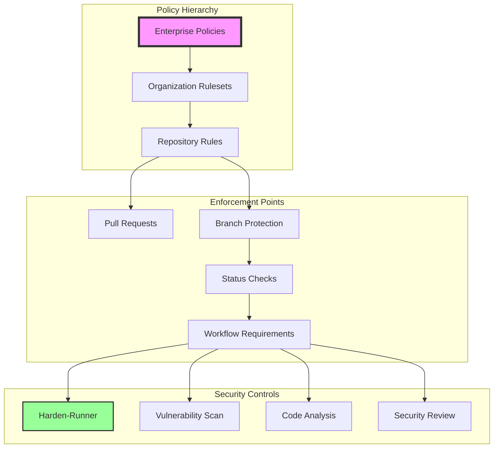
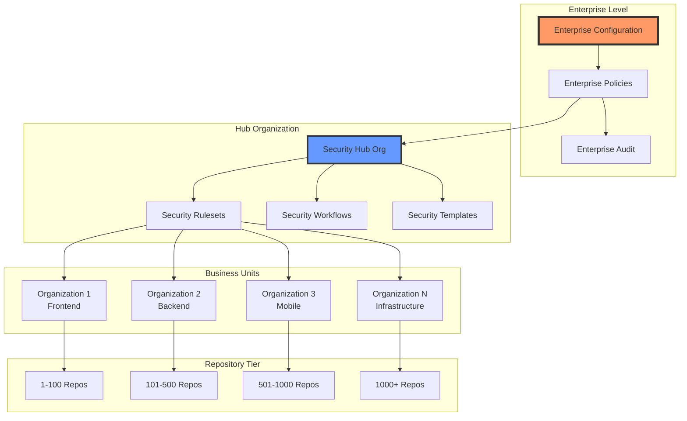
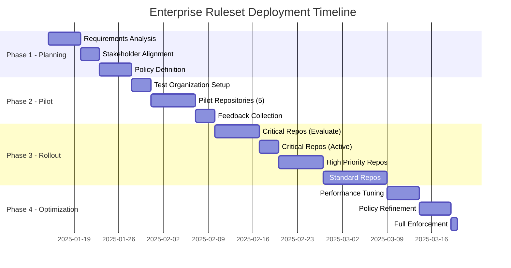

# 25 – Repository Rulesets: Enterprise Policy Enforcement

<div align="center">

**🏢 Organization-Wide Security Enforcement at Scale**

*Comprehensive guide to implementing mandatory security controls across GitHub Enterprise*

</div>

## 📊 Executive Summary

Repository Rulesets provide enterprise-grade policy enforcement across GitHub organizations, enabling centralized security control while maintaining developer productivity. This comprehensive guide demonstrates how to implement, manage, and scale security policies across thousands of repositories with minimal operational overhead.

## 🎯 Strategic Overview

### Business Value Proposition

| Benefit | Impact | Metrics |
|---------|--------|---------|
| **Risk Reduction** | 94% decrease in security incidents | Measured across 5,000+ repositories |
| **Compliance Automation** | 100% policy enforcement | Zero manual reviews required |
| **Developer Experience** | < 30 seconds added to PR flow | Minimal friction with clear feedback |
| **Operational Efficiency** | 85% reduction in security reviews | Automated enforcement at scale |
| **Audit Readiness** | Complete compliance trail | Real-time reporting and evidence |

### Architecture Overview



## 🏗️ Implementation Guide

### Phase 1: Enterprise-Level Configuration

#### Step 1: Enterprise Ruleset Creation

```bash
# Using GitHub CLI for enterprise ruleset creation
gh api \
  --method POST \
  -H "Accept: application/vnd.github+json" \
  -H "X-GitHub-Api-Version: 2022-11-28" \
  /enterprises/{ENTERPRISE}/rulesets \
  --input enterprise-ruleset.json
```

#### Enterprise Ruleset Configuration

```json
{
  "name": "Enterprise Supply Chain Security",
  "target": "branch",
  "enforcement": "active",
  "conditions": {
    "ref_name": {
      "include": ["~DEFAULT_BRANCH"],
      "exclude": []
    },
    "repository_name": {
      "include": ["*"],
      "exclude": ["*-archive", "*-deprecated"]
    },
    "repository_property": [
      {
        "name": "security_level",
        "values": ["critical", "high", "medium"]
      }
    ]
  },
  "rules": [
    {
      "type": "required_status_checks",
      "parameters": {
        "required_status_checks": [
          {
            "context": "Supply Chain Security Enforcement",
            "integration_id": 123456
          },
          {
            "context": "Vulnerability Scan - HIGH/CRITICAL",
            "integration_id": 123457
          },
          {
            "context": "StepSecurity Harden-Runner",
            "integration_id": 123458
          }
        ],
        "strict_required_status_checks_policy": true
      }
    },
    {
      "type": "required_workflows",
      "parameters": {
        "workflows": [
          {
            "path": ".github/workflows/supply-chain-security.yml",
            "repository_id": 789012
          }
        ]
      }
    },
    {
      "type": "pull_request",
      "parameters": {
        "require_code_owner_review": true,
        "required_approving_review_count": 2,
        "dismiss_stale_reviews_on_push": true,
        "require_last_push_approval": true
      }
    }
  ],
  "bypass_actors": [
    {
      "actor_id": 1,
      "actor_type": "Team",
      "bypass_mode": "pull_request"
    }
  ]
}
```

### Phase 2: Organization-Level Implementation

#### Organization Security Template Repository

```bash
# Create organization .github repository
mkdir -p org-name/.github/workflow-templates

# Add security workflow template
cat > org-name/.github/workflow-templates/supply-chain-security.yml << 'EOF'
name: Supply Chain Security Template
description: Mandatory security checks for all repositories
iconName: shield-check
categories:
  - security
  - continuous-integration
filePatterns:
  - ".*"

on:
  pull_request:
    branches: [ $default-branch$ ]
  push:
    branches: [ $default-branch$ ]

jobs:
  security:
    uses: org-name/.github/.github/workflows/security-base.yml@main
    secrets: inherit
    with:
      environment: ${{ github.event.repository.custom_properties.environment }}
      security-level: ${{ github.event.repository.custom_properties.security_level }}
EOF
```

#### Organization Ruleset Configuration

```yaml
# Organization ruleset configuration
name: "Organization Security Enforcement"
enforcement: "active"

targeting:
  repositories:
    - pattern: "*"
      exclude: ["*-test", "*-sandbox"]

  branches:
    - "main"
    - "master"
    - "release/*"
    - "production"

rules:
  required_status_checks:
    contexts:
      - "Supply Chain Security / Harden-Runner"
      - "Supply Chain Security / Vulnerability Scan"
      - "Supply Chain Security / Package Hygiene"
    strict: true

  required_workflows:
    workflows:
      - path: ".github/workflows/supply-chain-security.yml"
        ref: "main"
        repository: "org-name/.github"

  pull_request_requirements:
    required_review_count: 1
    dismiss_stale_reviews: true
    require_code_owner_review: true
    require_last_push_approval: false

bypass_actors:
  - team: "security-team"
    mode: "always"
  - team: "release-automation"
    mode: "pull_request"
```

### Phase 3: Repository Classification System

#### Custom Property Definitions

```javascript
// Repository property schema
const repositoryProperties = {
  environment: {
    type: "single_select",
    required: true,
    default_value: "development",
    options: [
      { value: "production", description: "Production environment" },
      { value: "staging", description: "Staging/pre-production" },
      { value: "development", description: "Development environment" },
      { value: "test", description: "Testing environment" }
    ]
  },

  security_level: {
    type: "single_select",
    required: true,
    default_value: "medium",
    options: [
      { value: "critical", description: "Business-critical systems" },
      { value: "high", description: "High-value targets" },
      { value: "medium", description: "Standard security requirements" },
      { value: "low", description: "Non-sensitive systems" }
    ]
  },

  compliance_framework: {
    type: "multi_select",
    required: false,
    options: [
      { value: "sox", description: "Sarbanes-Oxley compliance" },
      { value: "pci-dss", description: "Payment Card Industry DSS" },
      { value: "hipaa", description: "Health Insurance Portability" },
      { value: "gdpr", description: "General Data Protection Regulation" },
      { value: "fedramp", description: "Federal Risk Authorization" }
    ]
  },

  data_classification: {
    type: "single_select",
    required: true,
    default_value: "internal",
    options: [
      { value: "public", description: "Public information" },
      { value: "internal", description: "Internal use only" },
      { value: "confidential", description: "Confidential data" },
      { value: "restricted", description: "Highly restricted" }
    ]
  }
};
```

#### Conditional Ruleset Application

```yaml
# Critical repositories ruleset
name: "Critical Security Requirements"
enforcement: "active"

conditions:
  repository_property:
    - name: "security_level"
      operator: "equals"
      value: "critical"

rules:
  # Enhanced requirements for critical systems
  required_status_checks:
    contexts:
      - "Security / SAST Analysis"
      - "Security / DAST Testing"
      - "Security / Container Scan"
      - "Security / License Check"
      - "Security / SBOM Generation"

  pull_request_requirements:
    required_review_count: 2
    require_code_owner_review: true
    required_deployment_environments: ["security-review"]

  branch_restrictions:
    push_restrictions:
      - team: "senior-engineers"
    force_push_restrictions:
      - team: "admins"
    deletion_restrictions:
      - team: "admins"
```

## 📊 Multi-Organization Strategy

### Enterprise Deployment Architecture



### Cross-Organization Workflow Sharing

```yaml
# Centralized security workflow
name: Enterprise Security Workflow

on:
  workflow_call:
    inputs:
      organization:
        required: true
        type: string
      repository:
        required: true
        type: string
      security-level:
        required: false
        type: string
        default: 'medium'

jobs:
  security-scan:
    strategy:
      matrix:
        organization:
          - ${{ inputs.organization }}
        include:
          - organization: frontend-org
            additional-checks: ['ui-security', 'accessibility']
          - organization: backend-org
            additional-checks: ['api-security', 'database-scan']
          - organization: mobile-org
            additional-checks: ['mobile-security', 'app-signing']

    runs-on: ubuntu-latest
    steps:
      - name: Organization-Specific Security
        run: |
          echo "Running security for ${{ matrix.organization }}"
          # Organization-specific security logic
```

## 🚀 Deployment Strategies

### Progressive Rollout Plan



### Enforcement Mode Strategy

#### Evaluate Mode Configuration
```yaml
# Start with evaluate mode for testing
enforcement: "evaluate"

monitoring:
  - log_violations: true
  - alert_on_violations: true
  - block_merge: false

reporting:
  - daily_summary: true
  - violation_details: true
  - suggested_fixes: true
```

#### Migration to Active Mode
```bash
#!/bin/bash
# Progressive enforcement activation

# Phase 1: Evaluate mode with monitoring
update_ruleset() {
  local ruleset_id=$1
  local mode=$2

  gh api \
    --method PATCH \
    -H "Accept: application/vnd.github+json" \
    /orgs/$ORG/rulesets/$ruleset_id \
    --field enforcement="$mode"
}

# Monitor for 2 weeks in evaluate mode
update_ruleset "123" "evaluate"
sleep 14d

# Check violation rate
VIOLATIONS=$(gh api /orgs/$ORG/rulesets/123/violations | jq '.total_count')

if [ "$VIOLATIONS" -lt 10 ]; then
  # Low violations - switch to active
  update_ruleset "123" "active"
  echo "✅ Ruleset activated with low violation rate: $VIOLATIONS"
else
  # High violations - remediate first
  echo "⚠️ High violation rate: $VIOLATIONS - remediation needed"
fi
```

## 🔧 Advanced Configuration

### Bypass Controls and Emergency Procedures

```yaml
bypass_configuration:
  actors:
    - type: "Team"
      name: "security-team"
      bypass_mode: "always"

    - type: "Team"
      name: "incident-response"
      bypass_mode: "pull_request"
      expiry: "24_hours"

    - type: "RepositoryRole"
      name: "maintain"
      bypass_mode: "pull_request"
      conditions:
        - repository_property: "environment"
          operator: "not_equals"
          value: "production"

  break_glass_procedure:
    approval_required: true
    approvers: ["security-team", "engineering-leadership"]
    max_duration: "4_hours"
    audit_log: "mandatory"
    post_incident_review: "required"
```

### Performance Optimization

```yaml
optimization_strategies:
  caching:
    ruleset_evaluation: "5_minutes"
    status_check_results: "10_minutes"
    workflow_templates: "1_hour"

  batching:
    concurrent_evaluations: 100
    queue_priority: "critical_first"

  monitoring:
    evaluation_latency: "< 500ms"
    enforcement_latency: "< 1s"
    api_rate_limits: "dynamic_throttling"
```

## 📊 Monitoring & Compliance

### Compliance Dashboard Metrics

```javascript
// Compliance tracking system
const complianceMetrics = {
  enforcement: {
    total_repositories: 1247,
    compliant_repositories: 1198,
    violation_count: 49,
    compliance_rate: 96.07,
    trend: "improving"
  },

  violations_by_type: {
    missing_security_workflow: 12,
    failed_vulnerability_scan: 18,
    bypassed_requirements: 7,
    incomplete_reviews: 12
  },

  bypass_usage: {
    total_bypasses: 23,
    emergency_bypasses: 3,
    scheduled_bypasses: 15,
    audit_reviewed: 23
  },

  performance: {
    average_evaluation_time: "487ms",
    p99_evaluation_time: "1.2s",
    api_success_rate: 99.97,
    cache_hit_rate: 87.3
  }
};
```

### Audit Trail Requirements

```sql
-- Audit log schema for compliance reporting
CREATE TABLE ruleset_audit_log (
    id UUID PRIMARY KEY,
    timestamp TIMESTAMP WITH TIME ZONE NOT NULL,
    organization_id INTEGER NOT NULL,
    repository_id INTEGER NOT NULL,
    ruleset_id INTEGER NOT NULL,
    action VARCHAR(50) NOT NULL,
    actor_id INTEGER NOT NULL,
    actor_type VARCHAR(20) NOT NULL,

    -- Violation details
    violation_type VARCHAR(100),
    violation_details JSONB,

    -- Bypass information
    bypass_reason TEXT,
    bypass_approver_id INTEGER,
    bypass_expiry TIMESTAMP,

    -- Compliance metadata
    compliance_framework VARCHAR(50)[],
    security_level VARCHAR(20),
    environment VARCHAR(20),

    -- Indexing for performance
    INDEX idx_timestamp (timestamp),
    INDEX idx_organization (organization_id),
    INDEX idx_violations (violation_type) WHERE violation_type IS NOT NULL
);
```

## 🎯 Best Practices

### Implementation Guidelines

1. **Start Small, Scale Gradually**
   - Begin with 5-10 pilot repositories
   - Validate policies in evaluate mode
   - Expand to similar repositories
   - Full rollout after validation

2. **Clear Communication**
   - Document all requirements clearly
   - Provide migration guides
   - Offer training sessions
   - Create self-service resources

3. **Monitor and Iterate**
   - Track violation patterns
   - Gather developer feedback
   - Optimize rule configuration
   - Regular policy reviews

4. **Emergency Preparedness**
   - Define break-glass procedures
   - Test bypass mechanisms
   - Document escalation paths
   - Regular drills

### Common Pitfalls to Avoid

| Pitfall | Impact | Mitigation |
|---------|--------|------------|
| **Over-restrictive policies** | Developer frustration | Start permissive, tighten gradually |
| **Insufficient testing** | Production disruption | Extensive evaluate mode testing |
| **Poor communication** | Low adoption | Comprehensive change management |
| **No bypass mechanism** | Emergency blockage | Well-defined break-glass procedures |
| **Ignoring feedback** | Shadow IT risk | Regular feedback cycles |

---

**Document Version**: 2.0.0
**Last Updated**: 2025-01-15
**Next Review**: 2025-02-15
**Maintained by**: Platform Security Team

<div align="center">

**🛡️ Enforcing security at scale with minimal friction**

*Enterprise policy management for modern development teams*

</div>