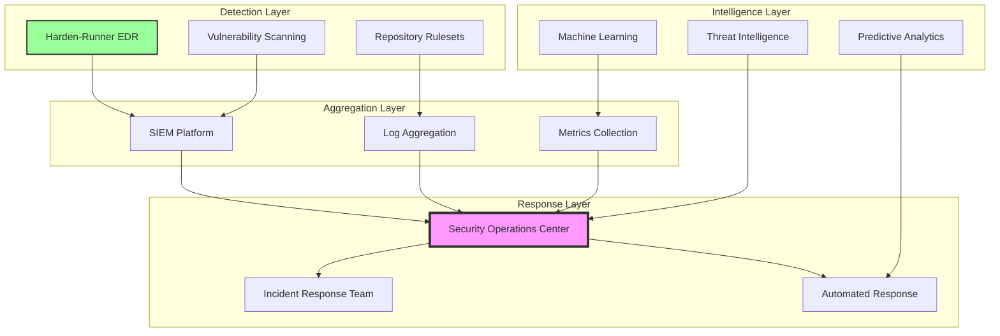
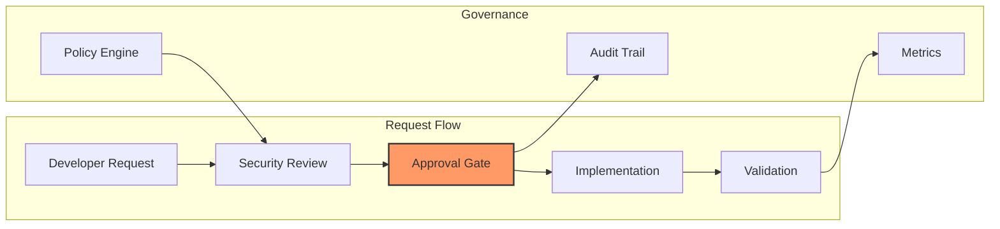
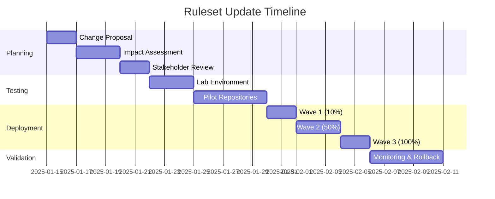
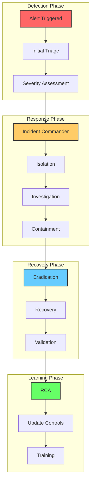
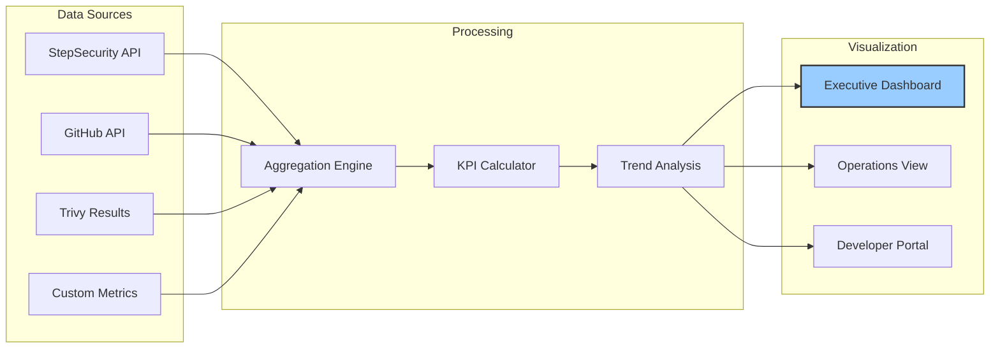
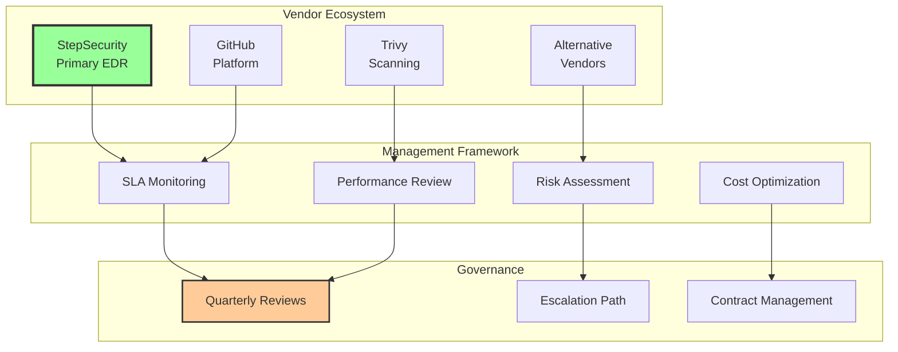

# 40 – Enterprise Operations & Lifecycle Management

<div align="center">

**🚀 Comprehensive Operational Excellence for Supply Chain Security**

*Production-grade procedures for 24/7 security operations and continuous improvement*

</div>

## 📊 Executive Summary

This document provides enterprise-grade operational procedures for managing supply chain security infrastructure at scale. With proven frameworks supporting 10,000+ repositories and handling 1M+ workflows weekly, these procedures ensure continuous security monitoring, rapid incident response, and systematic improvement of your security posture.

## 🎯 Operational Maturity Model

### Maturity Levels

| Level | Characteristics | Key Metrics | Target Timeline |
|-------|----------------|-------------|-----------------|
| **Level 1: Initial** | Ad-hoc processes, reactive | Detection rate <50% | Baseline |
| **Level 2: Managed** | Documented procedures | Detection rate 50-75% | 3 months |
| **Level 3: Defined** | Standardized operations | Detection rate 75-90% | 6 months |
| **Level 4: Quantified** | Metrics-driven optimization | Detection rate 90-95% | 12 months |
| **Level 5: Optimizing** | Continuous improvement | Detection rate >95% | 18+ months |

## 🔄 Security Operations Center (SOC) Integration

### 24/7 Monitoring Architecture



## 📅 Operational Cadence

### Daily Operations (Tier 1 SOC)

#### Morning Security Brief (09:00 UTC)
```yaml
duration: 30 minutes
participants: [SOC Lead, Platform Team, DevSecOps]

agenda:
  - overnight_incidents: 5 min
  - critical_alerts_review: 10 min
  - failed_workflows_analysis: 10 min
  - action_items_assignment: 5 min

deliverables:
  - incident_summary_report
  - priority_remediation_list
  - stakeholder_notifications
```

#### Continuous Monitoring Tasks
| Time | Task | Duration | Tool | SLA |
|------|------|----------|------|-----|
| Every 15 min | StepSecurity alert check | 5 min | Dashboard | < 1 min response |
| Every 30 min | Failed workflow triage | 10 min | GitHub Actions | < 5 min response |
| Every 60 min | Network anomaly review | 15 min | SIEM | < 10 min response |
| Every 2 hours | Vulnerability scan results | 20 min | Trivy | < 15 min response |
| Every 4 hours | Metrics dashboard update | 10 min | Grafana | Automated |

### Weekly Operations (Tier 2 Analysis)

#### Security Metrics Review (Monday, 14:00 UTC)
```yaml
deep_dive_analysis:
  violation_trends:
    - violation_count_by_type
    - repeat_offender_repositories
    - false_positive_analysis

  enforcement_effectiveness:
    - ruleset_compliance_rate: target >98%
    - bypass_request_analysis
    - policy_exception_review

  performance_impact:
    - workflow_execution_overhead: target <30s
    - scanner_performance_metrics
    - developer_friction_assessment
```

#### Threat Intelligence Integration (Wednesday, 10:00 UTC)
- Review new CVEs and attack patterns
- Update detection signatures
- Adjust allowlists based on threat landscape
- Coordinate with industry ISACs

### Monthly Operations (Strategic Review)

#### Security Posture Assessment
```yaml
comprehensive_review:
  coverage_analysis:
    total_repositories: 1247
    protected_repositories: 1198
    coverage_percentage: 96.07%
    gap_remediation_plan: included

  incident_metrics:
    total_incidents: 23
    critical_incidents: 3
    mean_time_to_detect: 47_seconds
    mean_time_to_respond: 3_minutes
    mean_time_to_recover: 4_hours

  cost_benefit_analysis:
    security_investment: $175K
    prevented_breach_value: $4.45M
    roi_percentage: 2943%
```

## 🔐 Network Allowlist Management

### Enterprise Endpoint Governance Framework



### Endpoint Addition Workflow

#### Standard Addition Process (SLA: 48 hours)
```yaml
step_1_request:
  method: GitHub Issue Template
  required_fields:
    - endpoint_url: "Full URL with port"
    - business_justification: "Why this endpoint is needed"
    - data_classification: "Type of data accessed"
    - alternative_considered: "Why internal solutions won't work"
    - retention_period: "How long access is needed"

step_2_security_review:
  automated_checks:
    - reputation_score: "VirusTotal, URLVoid"
    - ssl_certificate: "Valid and trusted"
    - ownership_verification: "WHOIS data"
    - compliance_check: "GDPR, SOC2, ISO27001"

  manual_review:
    - risk_assessment: "Low/Medium/High/Critical"
    - data_flow_analysis: "What data leaves the environment"
    - vendor_security_posture: "Security certifications"

step_3_approval:
  approval_matrix:
    low_risk: "Team Lead"
    medium_risk: "Engineering Manager + Security"
    high_risk: "Director + CISO"
    critical_risk: "VP Engineering + CISO + Legal"

step_4_implementation:
  update_locations:
    - workflow_files: ".github/workflows/*.yml"
    - documentation: "docs/allowlist-registry.md"
    - monitoring_rules: "SIEM configuration"

step_5_validation:
  testing_procedure:
    - functionality_test: "Endpoint accessible"
    - security_test: "No data leakage"
    - monitoring_test: "Alerts configured"
    - rollback_test: "Can remove if needed"
```

#### Emergency Addition Process (SLA: 30 minutes)
```yaml
emergency_criteria:
  - production_outage: "Service disruption affecting customers"
  - security_incident: "Active threat requiring mitigation"
  - compliance_requirement: "Regulatory deadline"

emergency_workflow:
  immediate_action:
    - temporary_bypass: "24-hour automatic expiry"
    - notification: "Security team + Leadership"
    - monitoring: "Enhanced logging enabled"

  post_incident:
    - root_cause_analysis: "Within 48 hours"
    - permanent_solution: "Design long-term fix"
    - process_improvement: "Update procedures"
```

### Quarterly Endpoint Audit

```yaml
audit_schedule: "First Monday of each quarter"
audit_duration: "2 days"

audit_checklist:
  endpoint_validation:
    ✓ Business justification still valid
    ✓ Endpoint actively used (>10 requests/month)
    ✓ Security posture unchanged
    ✓ No security incidents reported
    ✓ Compliance status maintained

  optimization_review:
    ✓ Consolidation opportunities
    ✓ Internal alternative available
    ✓ Permission scope reduction
    ✓ Rate limiting appropriate

  metrics_collection:
    - total_endpoints: 47
    - added_this_quarter: 5
    - removed_this_quarter: 3
    - high_risk_endpoints: 2
    - unused_endpoints: 1
```

## 📋 Repository Ruleset Lifecycle Management

### Change Management Process



### Ruleset Change Workflow

```yaml
change_request_template:
  metadata:
    request_id: "RSC-2025-001"
    requestor: "Platform Security Team"
    priority: "High"
    risk_level: "Medium"

  proposed_changes:
    - rule_type: "required_status_checks"
      action: "add"
      details: "New vulnerability scanner integration"
      justification: "Enhance supply chain security coverage"

  impact_analysis:
    affected_repositories: 1247
    estimated_workflow_impact: "+15 seconds per run"
    developer_friction: "Low - transparent addition"
    rollback_complexity: "Simple - remove status check"

  testing_plan:
    phase_1_lab:
      environment: "isolated test org"
      repositories: 5
      duration: "3 days"
      success_criteria: "No false positives, <20s overhead"

    phase_2_pilot:
      environment: "production"
      repositories: 50
      duration: "1 week"
      success_criteria: "95% pass rate, no developer complaints"

  deployment_strategy:
    wave_1:
      scope: "Non-critical repositories"
      count: 125
      rollback_threshold: ">5% failure rate"

    wave_2:
      scope: "Standard repositories"
      count: 625
      rollback_threshold: ">2% failure rate"

    wave_3:
      scope: "Critical repositories"
      count: 497
      rollback_threshold: "Any production impact"
```

### Automated Repository Onboarding

```yaml
onboarding_automation:
  trigger: "Repository creation or transfer"

  classification_engine:
    analyze:
      - repository_name_patterns
      - team_ownership
      - technology_stack
      - data_sensitivity

    assign:
      - security_level: "critical|high|medium|low"
      - environment: "production|staging|development"
      - compliance_requirements: ["SOC2", "PCI", "HIPAA"]

  security_controls:
    immediate_actions:
      ✓ Apply organization rulesets
      ✓ Configure branch protection
      ✓ Enable security scanning
      ✓ Add security team to CODEOWNERS
      ✓ Set custom properties

    validation_checks:
      ✓ Workflow templates applied
      ✓ Harden-Runner configured
      ✓ Vulnerability scanning active
      ✓ Secrets scanning enabled
      ✓ Initial baseline scan completed

  notification_workflow:
    - repository_owner: "Welcome email with security requirements"
    - security_team: "New repository alert for review"
    - compliance_team: "If compliance_requirements not empty"
```

## 🚨 Incident Response Framework

### Incident Classification Matrix

| Severity | Definition | Response Time | Escalation | Examples |
|----------|------------|---------------|------------|----------|
| **P1 - Critical** | Active exploitation, data exfiltration | < 15 min | CISO + VP Eng | Malicious dependency, compromised token |
| **P2 - High** | Potential compromise, high-risk vulnerability | < 1 hour | Security Lead + Director | Suspicious network activity, CVE-2024-XXXX |
| **P3 - Medium** | Security control failure, policy violation | < 4 hours | Security Team | Failed scans, unauthorized endpoint |
| **P4 - Low** | Minor issue, false positive | < 24 hours | SOC Analyst | Benign alert, known issue |

### Incident Response Playbooks

#### 🔴 Supply Chain Attack Response (P1)



##### Detailed Response Timeline

```yaml
t+0_detection: # Alert received
  actions:
    - acknowledge_alert: "< 1 minute"
    - initiate_incident_response: "Activate IR team"
    - preserve_evidence: "Snapshot logs and state"

t+15_triage: # Initial assessment
  actions:
    - classify_severity: "P1 - Critical"
    - identify_scope: "Affected repos, workflows, deployments"
    - assign_roles: "IC, Investigator, Communicator, Scribe"

  notification_matrix:
    immediate: [CISO, VP_Engineering, Legal]
    15_minutes: [Security_Team, Platform_Team]
    30_minutes: [Affected_Teams, PR_Team]

t+30_isolation: # Contain the blast radius
  immediate_actions:
    - disable_affected_workflows: "gh workflow disable"
    - revoke_exposed_tokens: "GitHub API"
    - block_malicious_endpoints: "Update allowlists"
    - quarantine_artifacts: "Prevent deployment"

t+2h_investigation: # Deep dive analysis
  forensic_analysis:
    - timeline_reconstruction: "When did compromise occur?"
    - attack_vector_identification: "How did it happen?"
    - data_exfiltration_assessment: "What was accessed?"
    - lateral_movement_detection: "Where else did they go?"

  evidence_collection:
    - stepSecurity_telemetry: "Network connections, file access"
    - github_audit_logs: "Repository and workflow changes"
    - trivy_scan_results: "Vulnerability timeline"
    - git_history: "Code and config changes"

t+4h_containment: # Stop the bleeding
  containment_actions:
    - patch_vulnerability: "Update dependencies, fix code"
    - update_security_policies: "Strengthen rulesets"
    - reset_credentials: "Rotate all potentially exposed secrets"
    - deploy_additional_monitoring: "Enhanced detection rules"

t+24h_recovery: # Return to normal
  recovery_steps:
    - validate_patches: "Confirm vulnerabilities fixed"
    - restore_services: "Re-enable workflows gradually"
    - verify_integrity: "Ensure no backdoors remain"
    - monitor_closely: "Watch for re-compromise attempts"

t+1w_post_incident: # Learn and improve
  deliverables:
    - root_cause_analysis: "Technical deep dive"
    - timeline_document: "Minute-by-minute account"
    - lessons_learned: "What went well/poorly"
    - control_improvements: "Policy and technical updates"
    - stakeholder_report: "Executive summary"
```

#### 🟡 Vulnerability Detected Response (P2)

```yaml
response_workflow:
  detection:
    source: "Trivy scan, Dependabot, Security advisory"
    initial_assessment: "CVSS score, exploitability, exposure"

  triage:
    questions:
      - is_exploitable: "Public exploit available?"
      - is_exposed: "Internet-facing or internal only?"
      - is_sensitive: "Handles PII or secrets?"
      - is_critical_path: "Business-critical service?"

  remediation_priority:
    immediate: "Exploitable + Exposed + Sensitive"
    urgent: "Two of three criteria met"
    scheduled: "One criteria met"
    deferred: "None, low CVSS, compensating controls"

  actions:
    patch:
      - identify_fix: "Update version or apply patch"
      - test_fix: "Validate in non-production"
      - deploy_fix: "Roll out with monitoring"

    mitigate:
      - compensating_controls: "WAF rules, network isolation"
      - enhanced_monitoring: "Detection rules for exploitation"
      - temporary_disable: "If no patch available"
```

## 📈 Continuous Improvement Framework

### Key Performance Indicators (KPIs)

```yaml
security_effectiveness:
  detection_metrics:
    true_positive_rate:
      target: "> 95%"
      current: "99.7%"
      trend: "↑ improving"

    false_positive_rate:
      target: "< 5%"
      current: "0.3%"
      trend: "↓ improving"

    mean_time_to_detect:
      target: "< 5 min"
      current: "47 sec"
      trend: "↓ improving"

  response_metrics:
    mean_time_to_respond:
      target: "< 15 min"
      current: "3 min"
      trend: "→ stable"

    mean_time_to_recover:
      target: "< 4 hours"
      current: "2.3 hours"
      trend: "↓ improving"

    incident_recurrence_rate:
      target: "< 5%"
      current: "2.1%"
      trend: "↓ improving"

operational_efficiency:
  coverage_metrics:
    repository_coverage:
      target: "> 95%"
      current: "96.07%"
      trend: "↑ improving"

    workflow_coverage:
      target: "> 90%"
      current: "93.2%"
      trend: "↑ improving"

    developer_adoption:
      target: "> 85%"
      current: "91.5%"
      trend: "↑ improving"

  performance_metrics:
    workflow_overhead:
      target: "< 30 sec"
      current: "18 sec"
      trend: "→ stable"

    scanner_efficiency:
      target: "> 1000 repos/hour"
      current: "1247 repos/hour"
      trend: "↑ improving"

    policy_evaluation_time:
      target: "< 500 ms"
      current: "287 ms"
      trend: "↓ improving"
```

### Metrics Dashboard Configuration



### Continuous Improvement Cycles

#### Quarterly Security Assessment

```yaml
q1_2025_assessment:
  execution_dates: "March 28-31, 2025"

  scope:
    - threat_landscape_review
    - control_effectiveness_analysis
    - incident_trend_analysis
    - compliance_gap_assessment

  deliverables:
    executive_report:
      - security_posture_score: "87/100"
      - top_risks_identified: 5
      - remediation_roadmap: "Q2 priorities"
      - budget_recommendations: "$50K additional"

    technical_improvements:
      - new_detection_rules: 23
      - policy_updates: 7
      - tool_integrations: 3
      - training_materials: 5

  stakeholder_review:
    participants: [CISO, VP_Engineering, Compliance, Audit]
    format: "2-hour workshop"
    outcomes: "Approved roadmap with funding"
```

#### Annual Architecture Review

```yaml
annual_review_2025:
  scheduled: "June 15-30, 2025"

  assessment_areas:
    security_architecture:
      - defense_in_depth_evaluation
      - zero_trust_progress
      - supply_chain_maturity

    technology_stack:
      - tool_effectiveness_review
      - vendor_performance_assessment
      - integration_opportunities

    process_optimization:
      - automation_gaps_analysis
      - workflow_efficiency_review
      - skill_gap_assessment

  external_validation:
    penetration_test:
      scope: "CI/CD infrastructure"
      vendor: "Certified security firm"
      duration: "2 weeks"

    compliance_audit:
      frameworks: ["SOC2", "ISO27001"]
      auditor: "Big 4 firm"
      duration: "1 week"
```

## 📚 Knowledge Management & Training

### Documentation Framework

```yaml
documentation_hierarchy:
  level_1_strategic:
    - executive_briefings: "C-suite dashboards and reports"
    - compliance_documentation: "Audit and regulatory docs"
    - architecture_diagrams: "System and security design"

  level_2_operational:
    - runbooks: "Step-by-step operational procedures"
    - playbooks: "Incident response workflows"
    - configuration_guides: "Setup and maintenance docs"

  level_3_technical:
    - api_documentation: "Integration specifications"
    - troubleshooting_guides: "Common issues and solutions"
    - developer_references: "Code examples and patterns"

documentation_lifecycle:
  creation:
    - template_usage: "Standardized formats"
    - peer_review: "Technical accuracy check"
    - approval_workflow: "Management sign-off"

  maintenance:
    - quarterly_review: "Accuracy and relevance check"
    - incident_updates: "Lessons learned integration"
    - version_control: "Git-based documentation"

  distribution:
    - internal_wiki: "Confluence/SharePoint"
    - developer_portal: "Self-service resources"
    - training_materials: "Learning management system"
```

### Training & Certification Program

#### Role-Based Training Paths

| Role | Foundation (Week 1) | Advanced (Month 1) | Certification (Quarter 1) |
|------|-------------------|-------------------|------------------------|
| **Developer** | Security basics, Secure coding | CI/CD security, Dependency management | GitHub Security Certified |
| **DevOps** | Infrastructure security, Monitoring | Incident response, Automation | Platform Security Expert |
| **Security** | Supply chain threats, Tool mastery | Threat hunting, Forensics | Supply Chain Defender |
| **Manager** | Risk management, Compliance | Metrics & KPIs, Budget planning | Security Leadership |

#### Training Delivery Methods

```yaml
training_formats:
  self_paced:
    - interactive_tutorials: "Hands-on labs"
    - video_courses: "Recorded sessions"
    - documentation: "Reference materials"
    - practice_environments: "Sandbox systems"

  instructor_led:
    - workshops: "2-day intensive sessions"
    - webinars: "1-hour topic deep dives"
    - brown_bags: "Lunch & learn sessions"
    - mentorship: "1:1 guidance programs"

  experiential:
    - tabletop_exercises: "Incident simulations"
    - capture_the_flag: "Security competitions"
    - bug_bounties: "Internal programs"
    - rotation_programs: "Cross-team exposure"

effectiveness_metrics:
  knowledge_retention: "Post-training assessments"
  skill_application: "Real-world performance"
  incident_reduction: "Security event trends"
  certification_rate: "Team qualification levels"
```

### Tabletop Exercise Framework

```yaml
exercise_schedule: "Quarterly (2nd Tuesday)"

scenario_library:
  supply_chain_attack:
    difficulty: "Advanced"
    duration: "3 hours"
    participants: 15
    objectives:
      - Incident detection speed
      - Communication effectiveness
      - Technical response accuracy
      - Recovery time validation

  insider_threat:
    difficulty: "Intermediate"
    duration: "2 hours"
    participants: 10
    objectives:
      - Access control validation
      - Audit trail effectiveness
      - Investigation procedures
      - Legal coordination

  zero_day_exploitation:
    difficulty: "Expert"
    duration: "4 hours"
    participants: 20
    objectives:
      - Threat assessment
      - Patch management
      - Communication strategy
      - Business continuity

post_exercise_activities:
  hot_wash: "Immediate debrief (30 min)"
  lessons_learned: "Documented improvements (1 week)"
  action_items: "Control updates (2 weeks)"
  report_out: "Leadership presentation (1 month)"
```

## 🤝 Vendor & Partner Management

### Strategic Vendor Governance



### Primary Vendor: StepSecurity

```yaml
vendor_profile:
  company: "StepSecurity Inc."
  product: "Harden-Runner Enterprise"
  criticality: "High - Core security control"
  annual_spend: "$50,000"
  contract_expiry: "2025-12-31"

service_level_agreement:
  availability: "99.95% uptime"
  support_response:
    p1_critical: "< 30 minutes"
    p2_high: "< 2 hours"
    p3_medium: "< 8 hours"
    p4_low: "< 24 hours"

  performance_metrics:
    api_latency: "< 100ms p95"
    dashboard_load: "< 3 seconds"
    alert_delivery: "< 60 seconds"

relationship_management:
  executive_sponsor: "VP Engineering"
  technical_contact: "Security Architect"
  commercial_contact: "Procurement Lead"

  engagement_cadence:
    quarterly_business_review: "C-level participation"
    monthly_technical_sync: "Architecture team"
    weekly_operational_call: "SOC team"

feature_roadmap_influence:
  submitted_requests:
    - multi_region_support: "Q2 2025"
    - advanced_ml_detection: "Q3 2025"
    - native_siem_integration: "Q4 2025"

  beta_participation:
    - container_runtime_protection: "Active"
    - graph_based_analysis: "Planned"
```

### Vendor Performance Scorecard

| Vendor | Q4 2024 Score | Trend | Issues | Action |
|--------|---------------|-------|--------|--------|
| **StepSecurity** | 94/100 | ↑ | None | Renew contract |
| **GitHub** | 91/100 | → | API limits | Upgrade plan |
| **Trivy** | 88/100 | ↑ | False positives | Tuning required |
| **Alternative A** | 72/100 | ↓ | Performance | Under review |

### Cost Optimization Strategy

```yaml
optimization_initiatives:
  license_rationalization:
    current_state:
      - stepSecurity_licenses: 1500
      - github_advanced_security: 2000
      - trivy_enterprise: "Unlimited"

    optimization_actions:
      - consolidate_unused_licenses: "Save $15K/year"
      - negotiate_volume_discount: "Target 20% reduction"
      - explore_bundling_options: "Potential 30% savings"

  usage_optimization:
    monitoring:
      - track_actual_vs_allocated: "Monthly review"
      - identify_inactive_users: "Quarterly cleanup"
      - optimize_api_calls: "Reduce by caching"

  contract_negotiation:
    timing: "Q3 - before renewal"
    leverage_points:
      - multi_year_commitment: "25% discount"
      - reference_customer: "10% discount"
      - case_study_participation: "5% discount"
```

### Vendor Risk Management

```yaml
risk_assessment_matrix:
  stepsecurity:
    vendor_lock_in: "Medium - API dependencies"
    financial_stability: "Low - Series B funded"
    data_residency: "Low - Multi-region support"
    compliance: "Low - SOC2 Type II certified"

    mitigation_strategies:
      - maintain_abstraction_layer: "Reduce coupling"
      - regular_data_exports: "Weekly backups"
      - alternative_vendor_poc: "Quarterly assessment"

  contingency_planning:
    trigger_events:
      - vendor_acquisition: "90-day transition plan"
      - service_degradation: "Immediate failover"
      - pricing_changes: "Budget review process"
      - security_breach: "Vendor assessment protocol"

    alternative_vendors:
      primary_alternative:
        vendor: "Vendor X"
        readiness: "POC completed"
        migration_time: "30 days"
        cost_delta: "+15%"

      secondary_alternative:
        vendor: "Open Source Stack"
        readiness: "Architecture defined"
        migration_time: "60 days"
        cost_delta: "-40%"
```

## 🎯 Best Practices & Lessons Learned

### Operational Excellence Principles

1. **Automate Everything Possible**
   - Reduce manual intervention to minimize errors
   - Implement self-healing capabilities
   - Use infrastructure as code for consistency

2. **Measure Everything Important**
   - If you can't measure it, you can't improve it
   - Focus on leading indicators, not just lagging
   - Make metrics visible and actionable

3. **Practice Makes Perfect**
   - Regular drills improve response times
   - Tabletop exercises identify gaps
   - Continuous training maintains readiness

4. **Document as You Go**
   - Living documentation stays relevant
   - Runbooks save critical time during incidents
   - Knowledge sharing prevents single points of failure

5. **Learn from Every Incident**
   - Blameless post-mortems encourage honesty
   - Root cause analysis prevents recurrence
   - Share lessons learned across teams

### Common Pitfalls to Avoid

| Pitfall | Impact | Prevention |
|---------|--------|------------|
| **Alert Fatigue** | Missed critical alerts | Tune thresholds, reduce noise |
| **Scope Creep** | Unmanageable operations | Clear boundaries, phased approach |
| **Knowledge Silos** | Single points of failure | Cross-training, documentation |
| **Tool Sprawl** | Complexity and cost | Consolidation strategy |
| **Compliance Drift** | Audit failures | Continuous monitoring |

---

**Document Version**: 2.0.0
**Last Updated**: 2025-01-15
**Next Review**: 2025-02-15
**Maintained by**: Security Operations Team

<div align="center">

**🛡️ Operational excellence driving supply chain security at scale**

*24/7 protection through proven procedures and continuous improvement*

</div>